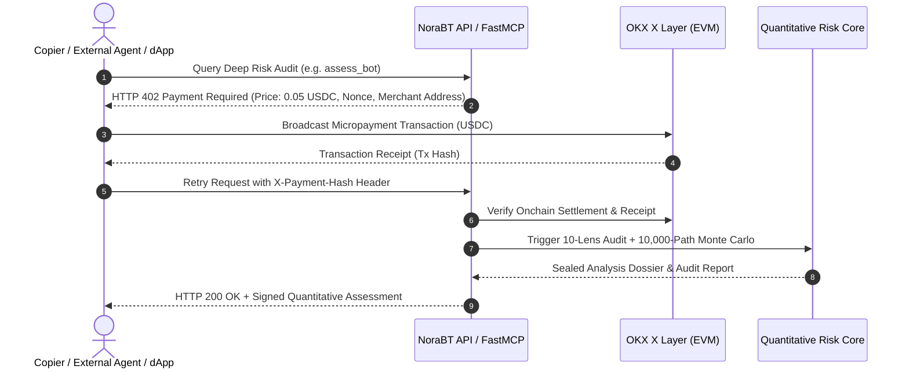
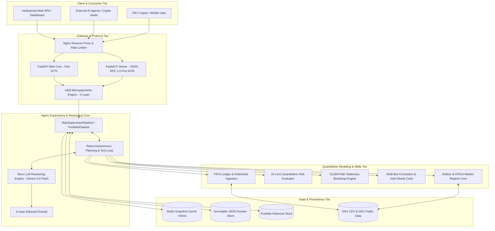

# NoraBT — Autonomous Quantitative Risk Supervisor & Multi-Bot Portfolio Guard on OKX

> **Track:** OKX AI — Agents & AI-Native Businesses  
> **Evaluation Deadline:** September 25, 2026  
> **Live Systems:** Web App (https://agent.expsolution.io, port `8770`), MCP server (port `8765`, `/mcp`), X Layer micropayments (x402)  
> **Install & usage:** see the repository [README](../../README.md)  
> **BMAD Master Index:** [SPEC-00: Specification Index](bmad/spec/00_overview/SPEC-00_SPECIFICATION_INDEX.md) & [STORY-00: Progression Status](bmad/story/00_overview/STORY-00_SYSTEM_PROGRESSION_AND_STATUS.md)  
> **Official Submission Report:** [Agent/docs/OKX_AI_REPORT.md](OKX_AI_REPORT.md)  

---

## PILLAR 1: Executive Summary & Problem-Solution Fit

### 1.1 Project Tagline
> **"Autonomous Quantitative Risk Supervisor & Multi-Bot Portfolio Copier Guard powered by OKX Market Intelligence, FastMCP, and X Layer Settlement."**

### 1.2 The Core Problem (Real Market Pain in Web3 & OKX Copy-Trading)
In contemporary cryptocurrency copy-trading (CEX) and decentralized automated liquidity management (DEX), retail copiers and institutional capital allocators suffer from severe information asymmetry and structural risks:
1. **Nominal Win-Rate Illusion & Hidden Floating Drawdowns:** Lead traders frequently manufacture artificial 90%+ win rates by taking quick micro-profits while bag-holding deep floating losses for weeks without stop-loss orders. These unrealized losses remain invisible in standard CEX leaderboards until an unexpected liquidation event wipes out the copier.
2. **Martingale & Aggressive Grid Escalation:** Bots double position sizes against adverse price action. During market flash crashes, liquidity dry-ups, or systemic tail events, these martingale structures suffer catastrophic liquidation cascades.
3. **The Multi-Bot "Diversification Illusion" (Cross-Bot Hidden Correlation):** Copiers allocate capital across 3 to 8 different bots running on distinct tickers (e.g., Bot A on BTC, Bot B on ETH, Bot C on SOL), assuming they are diversified. In reality, these bots frequently share identical breakout logic, execute directional positions concurrently, and accumulate correlated leverage. When market regimes shift, the portfolio suffers simultaneous maximum drawdown:
   $$MDD_{portfolio} \approx \sum w_i MDD_i \quad (\text{Zero Diversification Benefit})$$
4. **Absence of an Uncompromised, Autonomous Auditor in OKX AI Ecosystem:** Existing trading agents focus exclusively on order execution. There is no independent, read-only AI Risk Auditor capable of mathematically reconstructing FIFO order books, executing multi-asset joint stress testing, and delivering verifiable risk supervision.

### 1.3 The AI-Native Solution
Traditional static, rule-based (`if/else`) scripts cannot adapt to regime transitions, process tick-level unstructured orderbook histories across varying market conditions, or perform non-linear cross-bot correlation analysis.

**NoraBT** is built as an **autonomous, uncompromised AI-Native Risk Supervisor**:
- **FIFO Orderbook & Floating Loss Reconstruction:** Ingests live tick data from OKX CEX/DEX APIs, reconstructs tick-level execution ledgers, pairs buys and sells via strict FIFO accounting, and unmasks true peak-to-trough drawdowns and holding time decay.
- **10-Dimensional Quantitative Risk Engine:** Independently computes 10 orthogonal risk lenses:
  `drawdown_risk`, `tail_risk` (Fat-tail $VaR_{95\%}$, $CVaR_{95\%}$), `leverage_exposure`, `behavioral_risk` (Martingale detection), `strategy_drift`, `liquidity_execution`, `portfolio_risk`, `performance_quality`, `return_r_quality`, and `market_alignment`.
- **10,000-Path Stationary Bootstrap Monte Carlo:** Implements Politis & Romano (1994) stationary bootstrap to generate 10,000 synthetic return trajectories, coupled with Prof. Marcos López de Prado's **Deflated Sharpe Ratio (DSR)** and **Minimum Track Record Length (MinTRL)** to eliminate lucky outliers.
- **Multi-Bot Portfolio Joint Risk & Correlation Engine:** Simultaneously synchronizes equity curves for 2 to 8 bots, calculates cross-asset Pearson/Spearman return correlations and exit-rule Euclidean distances, executes Joint Monte Carlo stress testing, and quantifies the **Diversification Benefit Metric** ($\Delta_{div}$).
- **Deterministic LLM Reasoning Core:** Powered by `agy/gemini-3.8-flash-medium`, translating complex multidimensional risk surfaces into objective, third-person audit opinions with strict 5-gate editorial verification (Flesch-Kincaid grade 10–14, zero promotional bias, locked mathematical assertions).

### 1.4 AI-Native Business Model: The Agentic Economy
NoraBT monetizes its quantitative intelligence autonomously using the **x402 Protocol (HTTP 402 Payment Required)** on OKX's **X Layer Network**:



**Revenue Streams:**
1. **Onchain Micropayments (x402 over X Layer):**
   - Lightweight Cached Read (`get_assessment`): **$0.002 USDC** (Latency < 50ms via Redis).
   - Multi-Bot Portfolio Correlation Scan (`analyze_portfolio`): **$0.015 USDC**.
   - Heavyweight 10,000-Path Monte Carlo Deep Audit (`assess_bot`): **$0.050 USDC**.
2. **Performance-Based Copier Protection (Profit-Sharing):**
   - Smart contracts on X Layer allocate funds to verified Low-Risk/High-Quality bots and pay a 5% performance fee on protected net profits.
3. **B2B Risk-as-a-Service (MCP Server for Fund Managers & dApps):**
   - Subscription-based access to NoraBT's FastMCP server (`agent_server.py:8765`) for continuous risk monitoring and real-time webhook alerting.

---

## PILLAR 2: Technical Architecture & Agent Specification

### 2.1 System Architecture Diagram



### 2.2 Agent Reasoning Loop & Autonomous Execution
NoraBT implements a specialized, deterministic **ReAct (Reasoning + Acting) Supervisory Loop**:
1. **Planning Phase (Goal Decomposition):**
   - For single bot: $\text{Ingestion} \to \text{FIFO Reconstruction} \to \text{10-Lens Scoring} \to \text{Monte Carlo} \to \text{Veto} \to \text{Narrative}$.
   - For multi-bot portfolio: $\text{Parse 2-8 Codes} \to \text{Parallel Ledger Ingestion} \to \text{TimeSeries Merger} \to \text{Correlation Matrix} \to \text{Joint Monte Carlo} \to \text{Diversification Assessment}$.
2. **Tool Execution:** Tools are invoked strictly in read-only mode with token-bucket rate limiting against OKX endpoints.
3. **Self-Reflection & Exception Recovery Loop:**
   - **OKX Error 60004 Handling:** Invokes `assess_from_error()`, classifying state into `LIMITED` vs. `NOT_FOUND` using public profile & leaderboard weekly stats.
   - **Editorial Gate Fallback:** If the LLM generates output violating any of the 5 editorial gates, the gate rejects it and renders the deterministic synthesis (`_render_deterministic_thesis`), ensuring zero pipeline failures.

### 2.3 Context & Memory Architecture
- **Short-Term Session Memory:** In-memory session state, SSE progress updates, active calculation threads.
- **Long-Term Memory:**
  - Redis cache layer (<50ms reads) for computed dossiers.
  - Immutable file storage (`data/report/<bot_id>/latest.json`) conforming to Report Schema v3.
  - Portfolio historical store (`data/portfolios/`) for multi-bot tracking.

---

## PILLAR 3: OKX Ecosystem Integration Spec

### 3.1 OKX Infrastructure Mapping Table

| Component | OKX API / SDK / Contract | Implementation File | Architectural Purpose |
| :--- | :--- | :--- | :--- |
| **OKX CEX Copy-Trading API** | `GET /api/v5/copytrading/rest/current-subpositions`<br>`GET /api/v5/copytrading/rest/history-subpositions` | `Agent/backend/external/sources/bot_source.py` | Ingests real-time tick-level fill history and open positions; feeds the FIFO reconstructor. |
| **OKX Market Data API** | `GET /api/v5/market/candles`<br>`GET /api/v5/market/books` | `Agent/backend/external/sources/market_source.py`<br>`Agent/backend/market/service.py` | Ingests 1m/1h/1d candles, orderbook depth, and funding rates for benchmark alignment. |
| **Model Context Protocol (MCP)** | JSON-RPC 2.0 over FastMCP | `Agent/backend/scripts/agent_server.py`<br>`Agent/backend/bot/mcp/service.py` | Exposes 6 standardized tools to Claude Code, Cursor, and external autonomous trading agents. |
| **X Layer Network (Testnet/Mainnet)** | RPC: `https://xlayertestrpc.okx.com`<br>Chain ID: `195` (Testnet) / `196` (Mainnet) | `Agent/backend/payments/x402.py` | Settlement network for x402 micropayments in USDC; verifies payment hashes onchain. |

### 3.2 Tool & Skill Specifications

#### Tool 1: `assess_bot` (Deep Single-Bot Audit)
- **Function Name:** `assess_bot`
- **Input:** `{"bot_folder_name": "35F888C7BB441B2B", "asset": "BTC", "simulation_iterations": 10000}`
- **Output:** `AnalysisDossier` containing `risk_score` (0–100), `quality_score` (0–100), `verdict` (`HIDDEN RISK`, `CAPITAL PRESERVATION`, `CRITICAL DEFECT`), `cvar_95`, `deflated_sharpe_ratio`, and verified narrative.
- **Execution Limit:** 20 calls/min; cached read in <50ms.

#### Tool 2: `analyze_portfolio` (Multi-Bot Correlation & Joint Risk)
- **Function Name:** `analyze_portfolio`
- **Input:** `{"codes": ["35F888C7BB441B2B", "6F262ADB3B44266C"], "force": false}`
- **Output:** `PortfolioRiskAssessment` containing `correlation.pearson_matrix`, `correlation.exit_rule_distance`, `joint_simulation.mdd_joint_95`, `joint_simulation.diversification_benefit`, and `exposure.net_long_short`.
- **Execution Limit:** 5 calls/min; min 2, max 8 codes.

#### Tool 3: `get_market_regime` (Market Alignment & Regime Classification)
- **Function Name:** `get_market_regime`
- **Input:** `{"symbol": "BTC-USDT"}`
- **Output:** `regime` (`LOW_VOL_TREND`, `HIGH_VOL_TREND`, `COMPRESSION`, `EXPANSION`), `atr_14`, and `keltner_bandwidth`.
- **Execution Limit:** 60 calls/min.

---

## PILLAR 4: Safety Guardrails & Risk Management

### 4.1 Capital Protection & Strict Read-Only Policy
- **Absolute Read-Only Isolation:** NoraBT's API keys operate under **strict Read-Only permissions**. The codebase contains **ZERO withdrawal, transfer, or order execution methods**.
- **No Private Key Custody:** The agent never requests or stores user private keys. All onchain transactions are signed client-side via Web3 wallets.
- **The 6 Hard Safety Veto Thresholds:**
  1. `VETO-01` (Severe Tail Risk): Simulated $CVaR_{95\%} \ge 85\%$ or $MDD_{sim} \ge 90\%$.
  2. `VETO-02` (Extreme Outlier Loss): Historical 1-day drawdown exceeds $60\%$.
  3. `VETO-03` (Capital Destroying Martingale): Position size escalation factor $> 3.0$.
  4. `VETO-04` (Uncontrolled Leverage): Effective margin leverage $> 20x$ on altcoins.
  5. `VETO-05` (Strategy Drift): Rolling performance decorrelation $> 70\%$ from baseline.
  6. `VETO-06` (Liquidity Trap): Average trade size exceeds $5\%$ of available orderbook depth.

### 4.2 Human-in-the-Loop (HITL) Protocol
- **Autonomous Operations (100% Agent):** Data ingestion, orderbook reconstruction, 10-lens scoring, Monte Carlo simulation, correlation matrix computation, and editorial synthesis.
- **Gated Operations (Requires Explicit Human Signature):** Portfolio capital re-weighting or executing automated copy-stop orders; transferring USDC micropayments over X Layer.

### 4.3 Prompt Injection Defense & Mathematical Grounding
- **Zero Hallucination through Strict Grounding:** Every number cited in the narrative must match a cryptographically sealed metric in the `AnalysisDossier`.
- **5-Gate Editorial Firewall (`narrative.py`):**
  1. *Word Count Gate:* Strictly 80–150 words.
  2. *Readability Gate:* Flesch-Kincaid Grade Level bounded between 10.0 and 14.0.
  3. *Banned Buzzword Gate:* Immediate rejection if text contains generic AI promotional terms.
  4. *Numerical Consistency Gate:* Verifies that all percentages and drawdowns align with quantitative engine outputs.
  5. *Format Gate:* Strict 3-part structure: Thesis Conclusion $\to$ Mechanical Driver $\to$ Empirical Evidence prefixed with `◆`.

---

## PILLAR 5: Reproducibility & Evaluation Guide

### 5.1 Environment Setup (`.env.example`)

| Variable Name | Required? | Source / Description | Default / Example Value |
| :--- | :---: | :--- | :--- |
| `OKX_API_KEY` | Optional | OKX Open Platform API Key (Public endpoints work without key) | `your_okx_api_key` |
| `OKX_API_SECRET` | Optional | OKX Open Platform API Secret | `your_okx_api_secret` |
| `OKX_PASSPHRASE` | Optional | OKX Open Platform Passphrase | `your_okx_passphrase` |
| `LLM_MODEL` | Required | LLM Model for Narrative Synthesis & Copilot | `agy/gemini-3.8-flash-medium` |
| `XLAYER_RPC_URL` | Optional | OKX X Layer RPC Endpoint | `https://xlayertestrpc.okx.com` |
| `DATA_DIR` | Required | Local storage path for cached reports & trade ledgers | `Agent/data` |
| `PORT` | Required | Backend Web Server Port | `8770` |

### 5.2 Quickstart Commands (Under 5 Minutes)

```bash
# 1. Clone the repository
git clone https://github.com/nguyenhieptn/norabt.git
cd norabt

# 2. Set up Python environment & dependencies
pip install -r Agent/requirements.txt

# 3. Build Frontend React SPA
cd Agent/frontend
npm install
npm run build
cd ../..

# 4. Run automated verification (All 76 Portfolio Tests)
PYTHONPATH=. pytest Agent/none/test/test_portfolio_pipeline.py Agent/none/test/test_portfolio_web.py -v

# 5. Start the NoraBT Web Application & FastMCP Server
./start_nora.sh
```
*Access the Web Application at: `http://localhost:8770`*  
*FastMCP Server endpoint: `http://localhost:8765/mcp`*

---

### 5.3 Golden Test Cases for Evaluation Judges

#### Golden Test Case 1: Deep Single-Bot Risk Audit
```bash
curl -s -X POST http://localhost:8770/api/analyze \
  -H "Content-Type: application/json" \
  -d '{"code": "35F888C7BB441B2B"}'
```
*Expected Result:* HTTP 200 with complete JSON dossier: `risk_score` (37.28), `quality_score`, 10 dimensions, 10,000-path bootstrap simulation ($VaR_{95\%}$, $CVaR_{95\%}$, Deflated Sharpe Ratio), and 3rd-person objective audit narrative.

#### Golden Test Case 2: Multi-Bot Joint Portfolio Correlation Scan
```bash
curl -s -X POST http://localhost:8770/api/portfolio/analyze \
  -H "Content-Type: application/json" \
  -d '{"codes": ["35F888C7BB441B2B", "6F262ADB3B44266C", "58D7D205FB591484"]}'
```
*Expected Result:* HTTP 200 with 3x3 Pearson correlation matrix, exit-rule distance, joint bootstrap simulated drawdown ($MDD_{joint, 95\%}$), diversification benefit ($\Delta_{div}$), and directional exposure breakdown.

#### Golden Test Case 3: Safety Guardrail & Adversarial Veto Trigger
```bash
curl -s -X POST http://localhost:8770/api/portfolio/analyze \
  -H "Content-Type: application/json" \
  -d '{"codes": ["35F888C7BB441B2B"]}'
```
*Expected Result:* HTTP 400 Bad Request with immediate defensive response: `"detail": "Portfolio analysis requires at least 2 distinct bot codes"`, confirming that strict boundary checks execute before any network or compute resources are consumed.

---

## 6. BMAD Documentation Hierarchy

The repository maintains strict traceability through the **BMAD (Build More Architecture & Design)** standard:
- **Specifications (`Agent/docs/bmad/spec/`):**
  - [SPEC-00: Master Specification Index & Traceability Matrix](bmad/spec/00_overview/SPEC-00_SPECIFICATION_INDEX.md)
  - `01_prd_engine1/`: 10 Product Requirement Documents (`PRD-01` to `PRD-10`)
  - `02_technical_skills/`: 9 Deep Technical Capability Specifications (`SPEC-01` to `SPEC-09`), including the newly added [SPEC-09: Multi-Bot Portfolio Correlation & Joint Risk Engine](bmad/spec/02_technical_skills/SPEC-09_MULTI_BOT_PORTFOLIO_AND_CORRELATION_SKILL.md).
- **Development Lifecycle & Stories (`Agent/docs/bmad/story/`):**
  - [STORY-00: System Lifecycle & 9-Phase Progression](bmad/story/00_overview/STORY-00_SYSTEM_PROGRESSION_AND_STATUS.md)
  - 10 Business Domains with 100 fully verified User Stories.
