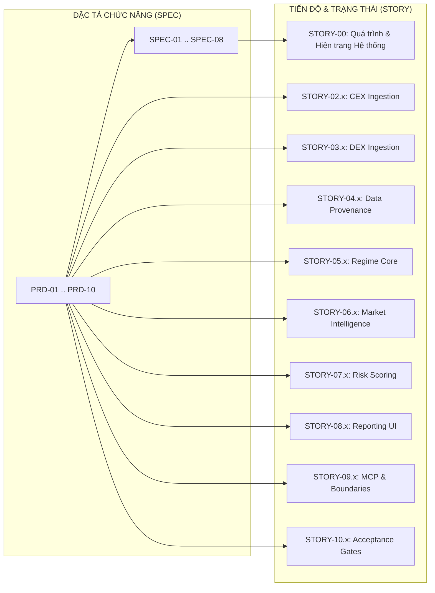

# SPEC-00: DANH MỤC & MA TRẬN ĐẶC TẢ KỸ THUẬT HỆ THỐNG AGENT (SPECIFICATION INDEX)

> **BMAD Document Standard**  
> **Document ID:** SPEC-00  
> **Type:** MASTER SPECIFICATION INDEX & TRACEABILITY MATRIX  
> **Status:** APPROVED / PRODUCTION  
> **Methodology Version:** 2.4.0  
> **Parent Scope:** NoraBT AI Risk Supervisor & Copier Guard on OKX  
> **Updated:** 2026-09-21  

---

## 1. Tổng Quan Mục Đích (Purpose & Scope)

Tài liệu này là **Bản đồ Đặc tả Kỹ thuật Toàn diện** của hệ thống NoraBT tại `Agent/docs/bmad/spec/`. Toàn bộ chức năng, năng lực thuật toán lượng hoá, đường nạp dữ liệu, động cơ mô phỏng, giao thức kết nối và giao diện người dùng đều được đặc tả chi tiết, phân rã theo chuẩn tài liệu **BMAD (Be Mad / Build More Architecture & Design)**.

Hệ thống được tổ chức thành 3 khối tài liệu kỹ thuật cốt lõi:
1. **Tầm nhìn Khởi tạo (Vision & Idea):** `IDEA-01`
2. **Yêu cầu Sản phẩm Engine 1 (PRD Suite - 10 Chuyên đề):** `PRD-01` đến `PRD-10`
3. **Đặc tả Kỹ năng & Kỹ thuật Chi Tiết (Technical Skill Specs - 9 Chuyên đề):** `SPEC-01` đến `SPEC-09`

---

## 2. Bản Đồ Đặc Tả Kỹ Năng Kỹ Thuật (Technical Specs Map)

| Mã Spec | Tên Đặc Tả Kỹ Năng (Capability Skill) | Phân Hệ Thực Thi (Target Codebase) | Mô Hình Toán / Thuật Toán Cốt Lõi |
| :--- | :--- | :--- | :--- |
| [SPEC-01](file:///home/ubuntu/norabt/Agent/docs/bmad/spec/02_technical_skills/SPEC-01_OKX_INGESTION_AND_LEDGER_SKILL.md) | **Thu Thập Dữ Liệu & Tái Cấu Trúc Sổ Lệnh OKX** | `Agent/backend/sources/`, `market/service.py` | Ghép lệnh FIFO, bóc tách floating loss, rate-limiting & backoff |
| [SPEC-02](file:///home/ubuntu/norabt/Agent/docs/bmad/spec/02_technical_skills/SPEC-02_MARKET_REGIME_AND_STRUCTURE_SKILL.md) | **Nhận Diện Chế Độ Thị Trường & Phân Tích Nến** | `Agent/backend/market/`, `lenses/market_alignment.py` | Keltner Channels, True Range / ATR14, 4 chế độ Micro/Macro |
| [SPEC-03](file:///home/ubuntu/norabt/Agent/docs/bmad/spec/02_technical_skills/SPEC-03_TEN_DIMENSIONAL_QUANTITATIVE_RISK_SKILL.md) | **Đo Lường Rủi Ro Lượng Hóa 10 Chiều** | `Agent/backend/qc/evaluator/lenses/` | 10 lăng kính độc lập: Drawdown, Tail Risk, Leverage, Martingale, Drift... |
| [SPEC-04](file:///home/ubuntu/norabt/Agent/docs/bmad/spec/02_technical_skills/SPEC-04_MONTE_CARLO_AND_STATIONARY_BOOTSTRAP_SKILL.md) | **Mô Phỏng Monte Carlo & Bootstrap Thống Kê** | `Agent/backend/mcp/analytics/simulation/` | 10.000 Stationary Bootstrap (Politis & Romano), CVaR 95%, DSR & MinTRL |
| [SPEC-05](file:///home/ubuntu/norabt/Agent/docs/bmad/spec/02_technical_skills/SPEC-05_SAFETY_VETO_AND_DECISION_ENGINE_SKILL.md) | **Veto An Toàn & Xếp Loại Chất Lượng** | `Agent/backend/qc/scoring/verdict.py`, `reasons.py` | 6 Tiêu chí Veto cứng, Ma trận 4 góc phần tư 2 trục (Sụt vốn × Chất lượng) |
| [SPEC-06](file:///home/ubuntu/norabt/Agent/docs/bmad/spec/02_technical_skills/SPEC-06_QUALITATIVE_NARRATIVE_SYNTHESIS_SKILL.md) | **Tổng Hợp Nhận Định Chuyên Môn Định Tính** | `Agent/backend/qc/reporting/narrative.py` | Cấu trúc 3 tầng + ký hiệu `◆`, 5 cổng kiểm duyệt (Flesch-Kincaid 10-14, cấm từ AI) |
| [SPEC-07](file:///home/ubuntu/norabt/Agent/docs/bmad/spec/02_technical_skills/SPEC-07_MCP_SERVER_AND_MICRO_PAYMENTS_SKILL.md) | **Máy Chủ MCP & Thanh Toán Vi Mô x402** | `Agent/backend/scripts/agent_server.py`, `payments/x402.py` | Chuẩn JSON-RPC 2.0, 6 tools MCP, USDC micro-payments trên X Layer |
| [SPEC-08](file:///home/ubuntu/norabt/Agent/docs/bmad/spec/02_technical_skills/SPEC-08_INSTITUTIONAL_UI_AND_VISUALIZATION_SKILL.md) | **Giao Diện Quản Trị & Báo Cáo Chuẩn Fintech** | `Agent/frontend/`, `tokens.css`, `report_page.py` | Bảng màu Deep Slate Obsidian (`#0B0F19`), typography Inter & JetBrains Mono |
| [SPEC-09](file:///home/ubuntu/norabt/Agent/docs/bmad/spec/02_technical_skills/SPEC-09_MULTI_BOT_PORTFOLIO_AND_CORRELATION_SKILL.md) | **Phân Tích Tổ Hợp Đa Bot & Tương Quan Danh Mục** | `Agent/backend/report/qc/portfolio/`, `pipeline_portfolio.py` | Ma trận Pearson/Spearman, khoảng cách chiến lược, Joint Monte Carlo, Diversification Benefit |

---

## 3. Danh Mục Yêu Cầu Sản Phẩm Engine 1 (PRD Suite)

| Mã PRD | Tên Chuyên Đề Yêu Cầu Sản Phẩm | Trọng Tâm Nghiệp Vụ |
| :--- | :--- | :--- |
| [PRD-01](file:///home/ubuntu/norabt/Agent/docs/bmad/spec/01_prd_engine1/PRD-01_ENGINE1_SCOPE_AND_SUCCESS.md) | **Engine 1 Scope and Success Criteria** | Phạm vi thẩm định bot, mục tiêu bảo vệ vốn và tiêu chí thành công |
| [PRD-02](file:///home/ubuntu/norabt/Agent/docs/bmad/spec/01_prd_engine1/PRD-02_OKX_CEX_DATA_FOUNDATION.md) | **OKX CEX Data Foundation** | Chuẩn thu thập nến, lệnh, funding rate và vị thế hợp đồng tương lai |
| [PRD-03](file:///home/ubuntu/norabt/Agent/docs/bmad/spec/01_prd_engine1/PRD-03_OKX_DEX_ONCHAIN_DATA_FOUNDATION.md) | **OKX DEX Onchain Data Foundation** | Thu thập thanh khoản pool, trượt giá onchain và rủi ro smart contract |
| [PRD-04](file:///home/ubuntu/norabt/Agent/docs/bmad/spec/01_prd_engine1/PRD-04_DATA_QUALITY_PROVENANCE_AND_STATE.md) | **Data Quality, Provenance and State** | Nguồn gốc dữ liệu (lineage), lọc trùng, chống làm giả số liệu và tính bất biến |
| [PRD-05](file:///home/ubuntu/norabt/Agent/docs/bmad/spec/01_prd_engine1/PRD-05_ENGINE1_REGIME_CORE.md) | **Engine 1 Regime Core** | Động cơ phân loại chế độ thị trường vi mô và vĩ mô |
| [PRD-06](file:///home/ubuntu/norabt/Agent/docs/bmad/spec/01_prd_engine1/PRD-06_ENGINE1_MARKET_INTELLIGENCE.md) | **Engine 1 Market Intelligence** | Trí thông minh thị trường: CVD, Orderbook Imbalance, Market Breadth |
| [PRD-07](file:///home/ubuntu/norabt/Agent/docs/bmad/spec/01_prd_engine1/PRD-07_ENGINE1_RISK_SCORING_AND_RANKING.md) | **Risk Scoring and Ranking Engine** | Thuật toán chuẩn hóa điểm rủi ro, điểm chất lượng và thứ hạng bot |
| [PRD-08](file:///home/ubuntu/norabt/Agent/docs/bmad/spec/01_prd_engine1/PRD-08_ENGINE1_REPORTING.md) | **Engine 1 Financial Reporting** | Định dạng hồ sơ thẩm định JSON, Server-rendered HTML và React SPA |
| [PRD-09](file:///home/ubuntu/norabt/Agent/docs/bmad/spec/01_prd_engine1/PRD-09_OKX_INTERACTION_AND_AGENT_INTERFACE.md) | **OKX Interaction & Agent Interface** | Ranh giới an toàn: Chỉ đọc dữ liệu (Read-only), cấm tuyệt đối can thiệp nộp rút |
| [PRD-10](file:///home/ubuntu/norabt/Agent/docs/bmad/spec/01_prd_engine1/PRD-10_ENGINE1_VERIFICATION_AND_DEFINITION_OF_DONE.md) | **Verification and Definition of Done** | Bộ 15 cổng nghiệm thu (Acceptance Gates), tính lặp lại (determinism) |

---

## 4. Tương Quan Giữa Spec và Story

Mọi chức năng được mô tả tại `spec/` đều có các User Stories tương ứng tại `story/` để theo dõi tiến độ triển khai và hiện trạng mã nguồn thực tế:

