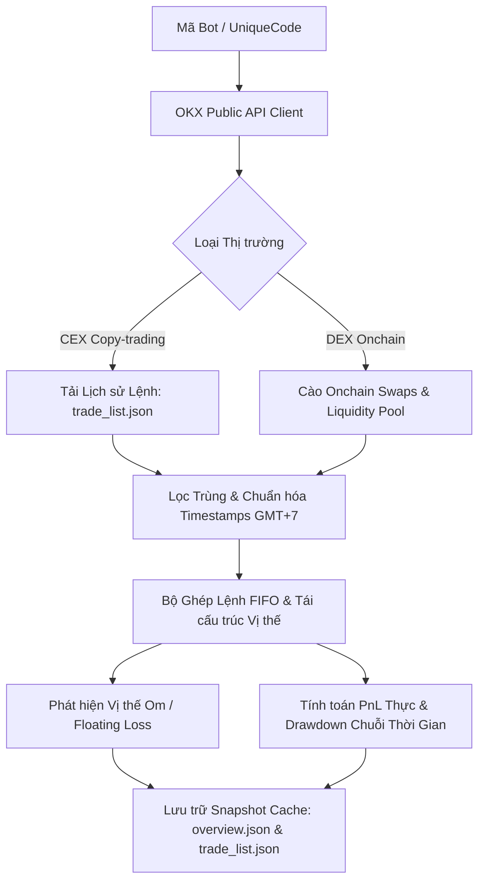

# SPEC-01: KỸ NĂNG THU THẬP DỮ LIỆU & TÁI CẤU TRÚC SỔ LỆNH OKX

> **BMAD Document Standard**  
> **Document ID:** SPEC-01  
> **Skill Name:** OKX Data Ingestion & Ledger Reconstruction Skill  
> **Type:** TECHNICAL CAPABILITY SPECIFICATION  
> **Status:** APPROVED / PRODUCTION  
> **Version:** 2.1.0  
> **Target Service:** `Agent/backend/sources/bot_source.py`, `Agent/backend/market/service.py`  
> **Updated:** 2026-09-18  

---

## 1. Tổng Quan & Bối Cảnh (Executive Summary)

Kỹ năng này chịu trách nhiệm thu thập, làm sạch, chuẩn hóa và tái cấu trúc sổ lệnh giao dịch của bot từ sàn giao dịch OKX (hỗ trợ cả Copy-trading CEX và Onchain DEX). 

### Vấn đề giải quyết:
Dữ liệu thô từ sàn OKX thường chỉ cung cấp PnL danh nghĩa và tỷ lệ thắng dựa trên các lệnh đã chốt, bỏ qua các vị thế đang gồng lỗ thả nổi (floating loss) hoặc các chu kỳ nạp/rút vốn làm sai lệch tỷ suất sinh lời thực tế. Kỹ năng này xây dựng lại chuỗi lịch sử vị thế chuẩn xác từ mức tick/lệnh.

---

## 2. Luồng Xử Lý Kỹ Thuật (Architectural Flow)



---

## 3. Quy Tắc Toán Học & Bóc Tách Kỹ Thuật

### 3.1. Thuật toán Ghép Lệnh FIFO (First-In, First-Out)
Mỗi lệnh mở vị thế ($O_i$) được ghép lần lượt với các lệnh đóng vị thế ($C_j$) tương ứng theo thứ tự thời gian:
$$PnL_{trade} = \sum_{k} Q_k \cdot (P_{exit, k} - P_{entry, k}) \cdot Direction - Fees$$
Trong đó:
- $Direction = 1$ cho vị thế Mua (Long) và $-1$ cho vị thế Bán khống (Short).
- $Q_k$ là khối lượng khớp lệnh từng phần.
- Phí giao dịch sàn (Taker fee, Maker fee, Funding fee) được khấu trừ trực tiếp vào $PnL$ ròng.

### 3.2. Phân biệt Trạng thái Tài sản (Asset State Detection)
Kỹ năng phân loại chính xác 3 trạng thái của tài sản mà bot giao dịch:
1. **ĐANG GIAO DỊCH (`TRADING`):** Có lệnh mở và đóng đều đặn trong chu kỳ quan sát.
2. **CHỈ ĐANG ÔM (`HOLDING_ONLY`):** Bot mở vị thế mua/bán nhưng cố tình om lệnh không chịu chốt lỗ dù giá đã đi ngược xu hướng.
3. **ĐÃ RỜI (`EXITED`):** Đã tất toán toàn bộ khối lượng vị thế và không phát sinh lệnh mới.

### 3.3. Xử lý Lỗi & Khả năng Chống Nghẽn (Resilience & Rate Limiting)
- **Exponential Backoff:** Tự động retry với khoảng trễ lũy thừa khi chạm giới hạn tần suất gọi API của OKX (HTTP 429 Too Many Requests).
- **Graceful Fallback:** Nếu API sàn trả về thiếu một số trường phụ, hệ thống đánh dấu cờ `INSUFFICIENT_DATA` tại trường đó thay vì làm sập toàn bộ quy trình phân tích.

---

## 4. Tiêu Chuẩn Đầu Ra (Output Contract)

Dữ liệu sổ lệnh chuẩn hóa được ghi vào tệp `trade_list.json` với cấu trúc:
```json
{
  "code": "741867347484730662",
  "symbol": "BTC-USDT-SWAP",
  "total_trades": 184,
  "start_time_ms": 1726000000000,
  "end_time_ms": 1726600000000,
  "trades": [
    {
      "trade_id": "9812471029",
      "timestamp_ms": 1726543200000,
      "side": "BUY",
      "price": 58420.5,
      "amount": 0.15,
      "realized_pnl": 142.3,
      "fee": 0.45,
      "is_closed": true
    }
  ],
  "holding_positions": []
}
```

---

## 5. Ma Trận Truy Vết Mã Nguồn (Traceability Matrix)

- **Module thực thi:**
  - [bot_source.py](file:///home/ubuntu/norabt/Agent/backend/sources/bot_source.py): Nạp và xác thực dữ liệu bot từ OKX.
  - [data.py](file:///home/ubuntu/norabt/Agent/backend/web/data.py): Tái tạo cấu trúc dữ liệu cho Web API.
- **Tệp kiểm thử:**
  - `Agent/none/test/test_bot_source.py`: Kiểm thử toàn vẹn dữ liệu sổ lệnh.
  - `Agent/none/test/test_trade_cadence.py`: Kiểm tra chu kỳ vào lệnh và phát hiện om lệnh.
- **Tiêu chí nghiệm thu (BMAD AC):**
  - **AC-01.1:** 100% lệnh trong sổ lệnh được khớp FIFO không bị âm khối lượng tồn.
  - **AC-01.2:** Nhận diện và cắm cờ chính xác khi bot phát sinh vị thế om lỗ quá 72 giờ.
