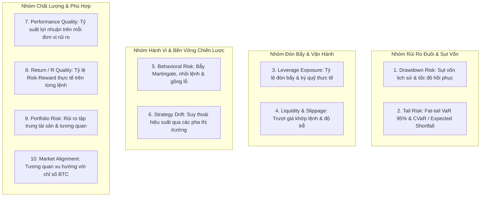

# SPEC-03: KỸ NĂNG ĐO LƯỜNG RỦI RO LƯỢNG HÓA 10 CHIỀU

> **BMAD Document Standard**  
> **Document ID:** SPEC-03  
> **Skill Name:** 10-Dimensional Quantitative Risk Assessment Skill  
> **Type:** TECHNICAL CAPABILITY SPECIFICATION  
> **Status:** APPROVED / PRODUCTION  
> **Version:** 2.2.0  
> **Target Service:** `Agent/backend/qc/evaluator/lenses/`  
> **Updated:** 2026-09-18  

---

## 1. Tổng Quan & Bối Cảnh (Executive Summary)

Đánh giá một chiến lược giao dịch bằng một vài chỉ số truyền thống (như PnL hoặc Sharpe thông thường) là cực kỳ nguy hiểm trong thị trường tiền số vì phân phối lợi nhuận mang đặc tính đuôi dày (fat tails), bất đối xứng và độ lệch lớn.

Kỹ năng này triển khai **10 lăng kính lượng hóa độc lập**, mỗi lăng kính đại diện cho một góc nhìn đo lường rủi ro chuyên biệt nhằm bóc tách toàn diện hành vi thực sự của bot.

---

## 2. Bóc Tách Chi Tiết 10 Lăng Kính Rủi Ro (The 10 Risk Lenses)

### Chi tiết kỹ thuật từng lăng kính:

1. **Drawdown Risk (`drawdown_risk.py`):**
   - Đo lường mức sụt vốn tối đa trong lịch sử (Max Drawdown - MDD).
   - Đo lường thời gian hồi phục vốn (Recovery Period) và độ sâu sụt vốn bình quân (Ulcer Index).
2. **Tail Risk (`tail_risk.py`):**
   - Ứng dụng mô hình **Value at Risk (VaR 95%)** phi tham số trên chuỗi PnL thực.
   - **Conditional Value at Risk (CVaR / Expected Shortfall):** Đo mức lỗ bình quân khi rơi vào 5% kịch bản xấu nhất.
3. **Leverage Exposure (`leverage_exposure.py`):**
   - Đo lường hệ số đòn bẩy danh nghĩa và đòn bẩy hiệu dụng dựa trên quy mô tài sản quản lý (AUM) so với giá trị vị thế mở.
   - Cảnh báo khi bot dùng đòn bẩy vượt ngưỡng an toàn ($> 10x$ trên altcoin, $> 20x$ trên BTC).
4. **Liquidity & Execution (`liquidity_execution.py`):**
   - Đánh giá tỷ lệ trượt giá (slippage) giữa giá kỳ vọng và giá khớp thực tế.
   - Cảnh báo bot giao dịch khối lượng lớn trên các cặp coin thanh khoản mỏng (Low Market Cap).
5. **Behavioral Risk (`behavioral_risk.py`):**
   - Thuật toán nhận diện mô hình **Martingale** (gấp thếp khối lượng khi đang lỗ để kéo hòa vốn).
   - Nhận diện hành vi **DCA không giới hạn** và giữ lệnh âm (unrealized loss) bất thường.
6. **Strategy Drift (`strategy_drift.py`):**
   - Đo lường sự thay đổi trong tần suất vào lệnh, thời gian nắm giữ lệnh trung bình khi thị trường đổi pha.
   - Phát hiện hiện tượng bot "vỡ trận", thay đổi phong cách giao dịch đột ngột.
7. **Performance Quality (`performance_quality.py`):**
   - Đo lường **Calmar Ratio** ($Return / MDD$) và **Omega Ratio** (tỷ số giữa tổng phần thắng và tổng phần thua có trọng số).
8. **Return / R Quality (`return_r_quality.py`):**
   - Đo lường tỷ số $R$ thực tế: tỷ lệ giữa lợi nhuận trung bình trên lệnh thắng so với mức lỗ trung bình trên lệnh thua.
   - Loại bỏ các bot có tỷ lệ thắng 95% nhưng mỗi lệnh thắng chỉ ăn 1 đồng còn lệnh thua gánh 20 đồng.
9. **Portfolio Risk (`portfolio_risk.py`):**
   - Đánh giá mức độ tập trung vốn vào một số ít tài sản rủi ro cao hoặc danh mục nắm giữ các token có tương quan giảm cùng lúc.
10. **Market Alignment (`market_alignment.py`):**
    - Kiểm định tính độc lập của bot: Bot kiếm tiền nhờ alpha thực sự hay chỉ là beta thụ động đi theo đà tăng chung của thị trường.

---

## 3. Thang Đo & Quy Chuẩn Xếp Hạng (Tiers)

Mỗi chiều được chuẩn hóa thành 5 bậc rủi ro nghiêm ngặt:
- `HEALTHY` (Khỏe - Điểm rủi ro < 30)
- `WATCH` (Theo dõi - Điểm rủi ro 30 - 50)
- `ELEVATED` (Nâng cao - Điểm rủi ro 50 - 70)
- `HIGH` (Cao - Điểm rủi ro 70 - 85)
- `CRITICAL` / `EMERGENCY` (Nghiêm trọng / Khẩn cấp - Điểm rủi ro > 85)

---

## 4. Ma Trận Truy Vết Mã Nguồn (Traceability Matrix)

- **Module thực thi:** Toàn bộ tệp mã trong thư mục `Agent/backend/qc/evaluator/lenses/`.
- **Tệp kiểm thử:**
  - `Agent/none/test/test_qc_signals.py`: Kiểm tra độ nhạy và tính toán của từng lăng kính.
  - `Agent/none/test/test_quality_and_safety.py`: Kiểm thử tổng hợp 10 lăng kính rủi ro.
