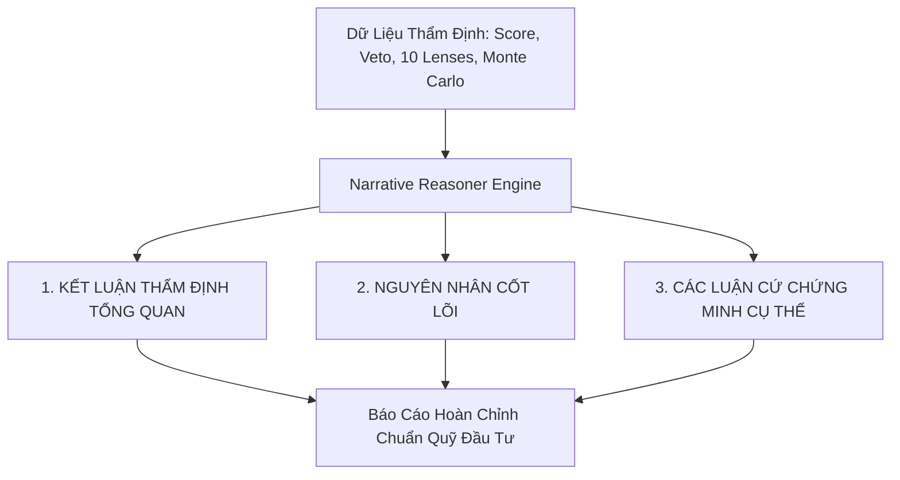

# SPEC-06: KỸ NĂNG TỔNG HỢP NHẬN ĐỊNH CHUYÊN MÔN ĐỊNH TÍNH

> **BMAD Document Standard**  
> **Document ID:** SPEC-06  
> **Skill Name:** Qualitative Narrative Synthesis Skill  
> **Type:** TECHNICAL CAPABILITY SPECIFICATION  
> **Status:** APPROVED / PRODUCTION  
> **Version:** 2.1.0  
> **Target Service:** `Agent/backend/qc/reporting/narrative.py`  
> **Updated:** 2026-09-18  

---

## 1. Tổng Quan & Bối Cảnh (Executive Summary)

Một báo cáo tài chính định lượng chuyên nghiệp không thể chỉ bao gồm các bảng số liệu khô khan. Người dùng (cả nhà đầu tư cá nhân lẫn quản lý quỹ) cần một bản **Nhận định Chuyên môn (Expert Qualitative Narrative)** có văn phong chuẩn mực của một Chuyên gia Thẩm định Quỹ (Institutional Risk Auditor).

Kỹ năng này chịu trách nhiệm:
- Đọc hiểu toàn bộ kết quả định lượng (sổ lệnh, 10 chiều rủi ro, phân phối Monte Carlo, trạng thái Veto).
- Tự động tổng hợp thành bài phân tích sắc sảo gồm 3 phần: **Kết Luận Đanh Thép → Nguyên Nhân Cốt Lõi → Bằng Chứng Định Lượng Cụ Thể (`◆`)**.
- Loại bỏ hoàn toàn các dấu vết máy móc, AI placeholder, đảm bảo tính khách quan và thẩm quyền chuyên môn cao nhất.

---

## 2. Cấu Trúc Báo Cáo Nhận Định (Narrative Structure)

### 2.1. Quy Chuẩn 3 Tầng Lập Luận (3-Tier Reasoning Architecture)

1. **Tầng 1: Kết Luận Thẩm Định (Verdict Statement):**
   - Đưa ra khuyến nghị dứt khoát: Khuyến nghị theo dõi, hạn chế phân bổ vốn, hoặc cấm tuyệt đối (Veto).
   - Ví dụ: *"Bot này thuộc nhóm SỤT VỐN: CAO · CHẤT LƯỢNG: YẾU và đã vi phạm quy chuẩn an toàn. Hệ thống khuyến nghị KHÔNG COPY hoặc rút vốn ngay lập tức."*
2. **Tầng 2: Nguyên Nhân Cốt Lõi (Core Causes):**
   - Giải thích bản chất vì sao bot có điểm số như vậy. 
   - Ví dụ: Phân tích kỹ thuật vào lệnh, tỷ lệ Risk/Reward bị lệch, việc sử dụng đòn bẩy quá mức trên tài sản biến động mạnh.
3. **Tầng 3: Các Luận Cứ Chứng Minh (`◆ Evidence Points`):**
   - Mỗi luận cứ bắt đầu bằng ký hiệu `◆` và dẫn chứng trực tiếp số liệu thực tế:
     - `◆` Mức sụt vốn tối đa ghi nhận là $48.2\%$ trong khi lợi nhuận tích lũy chỉ đạt $+12.4\%$.
     - `◆` Trong 10.000 kịch bản mô phỏng Monte Carlo, mức Expected Shortfall đạt $-64.5\%$, tiệm cận ngưỡng cháy tài khoản.
     - `◆` Bot phát sinh 4 chu kỳ gồng lệnh lỗ kéo dài trên 96 giờ với đòn bẩy $20x$ trên token biến động cao.

---

## 3. Quy Chuẩn Ngôn Ngữ & Tính Toàn Vẹn (Integrity & Language Rules)

- **Quốc tế hóa đầu ra công khai (Public Output):** Chuẩn hóa toàn bộ nhận định người dùng đọc (`expert_assessment`) sang tiếng Anh chuẩn Wall Street Institutional Auditor để phục vụ niêm yết trên OKX AI Marketplace toàn cầu. Chú thích kiến trúc và hồ sơ thiết kế nội bộ duy trì tiếng Việt.
- **Mô hình LLM:** Vận hành qua `agy` / `gemini-3.8-flash-medium` với độ ổn định cao, thời gian xử lý cohort 31 bot giảm từ 45 phút xuống 11 phút.
- **5 Cổng Kiểm Duyệt Chất Lượng Bắt Buộc (5 Verification Gates):**
  1. *Gate 1 (Length):* Số từ nằm trong dải quy định (80 - 150 từ), không dài dòng thừa thãi.
  2. *Gate 2 (Readability):* Chỉ số Flesch-Kincaid Grade Level nằm trong ngưỡng chuyên gia: 10.0 đến 14.0 (trần 16.0).
  3. *Gate 3 (Forbidden Words):* Loại bỏ 100% từ cấm và nhãn máy móc ("AI model", "Claude", "ChatGPT", "prompt", "hallucination").
  4. *Gate 4 (Digit Locking):* Mọi con số trong nhận định phải khớp chính xác tuyệt đối với số liệu định lượng (PnL, Drawdown, VaR, Win Rate).
  5. *Gate 5 (Semantic & Tone):* Giọng văn khách quan của thẩm định viên quỹ (Risk Auditor), không đưa ra lời khuyên đầu tư ủy thác tài chính.
- **Độ tin cậy dữ liệu:** Nếu dữ liệu bị thiếu hoặc bot mới chạy, nhận định phải nêu rõ kích thước mẫu và thời lượng quan sát cần thiết.

---

## 4. Ma Trận Truy Vết Mã Nguồn (Traceability Matrix)

- **Module thực thi:**
  - [narrative.py](file:///home/ubuntu/norabt/Agent/backend/qc/reporting/narrative.py): Tổng hợp lập luận và trích xuất luận cứ.
  - [report_page.py](file:///home/ubuntu/norabt/Agent/backend/web/report_page.py): Hiển thị nhận định chuyên môn trong khối Hero và Tab Nhận định.
- **Tệp kiểm thử:**
  - `Agent/none/test/test_narrative.py`: Kiểm thử cấu trúc 3 tầng và định dạng luận cứ.
  - `Agent/none/test/test_run_report_narrative.py`: Kiểm tra sinh nhận định trong luồng báo cáo hoàn chỉnh.
