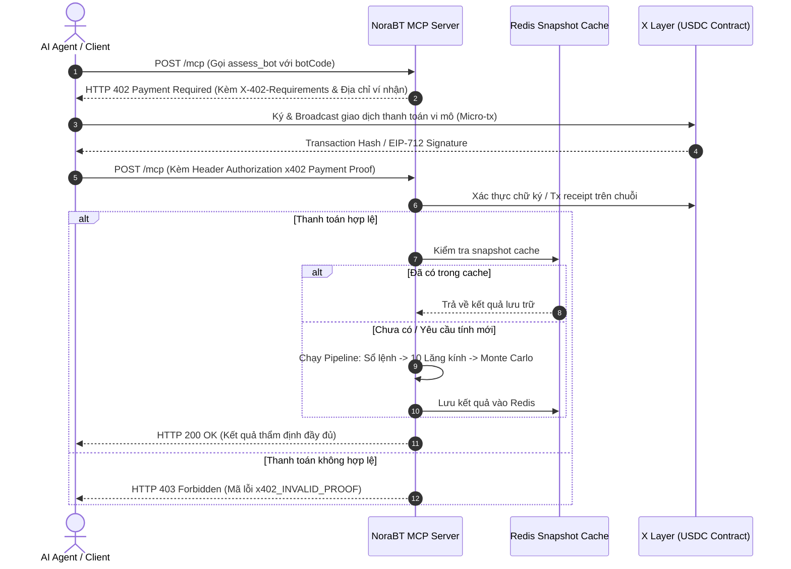

# SPEC-07: KỸ NĂNG MÁY CHỦ MCP & THANH TOÁN VI MÔ X402

> **BMAD Document Standard**  
> **Document ID:** SPEC-07  
> **Skill Name:** MCP Server Protocol & x402 Micro-Payments Skill  
> **Type:** TECHNICAL CAPABILITY SPECIFICATION  
> **Status:** APPROVED / PRODUCTION  
> **Version:** 2.1.0  
> **Target Service:** `Agent/backend/scripts/agent_server.py`, `Agent/backend/payments/x402.py`  
> **Updated:** 2026-09-18  

---

## 1. Tổng Quan & Bối Cảnh (Executive Summary)

Trong bối cảnh nền kinh tế AI Agent (Agent Economy) trên OKX và các mạng blockchain, các dịch vụ không chỉ phục vụ người dùng qua trình duyệt mà còn phải đóng vai trò là một **Tool Provider** chuẩn mực cho các AI Agent khác truy vấn tự động thông qua giao thức mở **Model Context Protocol (MCP)** của Anthropic.

Đồng thời, để đảm bảo tính thương mại và bù đắp chi phí tài nguyên máy tính (CPU/RAM khi chạy 10.000 mô phỏng Monte Carlo), hệ thống tích hợp chuẩn thanh toán **x402 (HTTP 402 Payment Required)** sử dụng token thanh toán onchain.

---

## 2. Danh Mục Công Cụ MCP (MCP Tool Registry)

Máy chủ MCP chạy độc lập trên cổng **8000** (hoặc tích hợp qua backend web), tuân thủ đặc tả JSON-RPC 2.0:

| Tên Công Cụ | Chi Phí (x402) | Tần Suất & Tốc Độ | Mô Tả Chức Năng |
| :--- | :---: | :---: | :--- |
| `list_assets` | Miễn phí | Tức thì (< 10ms) | Liệt kê tất cả tài sản có dữ liệu đã cào trên đĩa và các sàn hỗ trợ (`CEX`/`DEX`). |
| `list_bots` | Miễn phí | Tức thì (< 15ms) | Liệt kê danh sách các bot đã cào cho một tài sản trên sàn cụ thể (thư mục, nickname, unique code). |
| `list_assessed_bots` | $0.001 USDC | Rất nhanh (< 20ms) | Liệt kê các bot đã thẩm định từ `index.json`, hỗ trợ lọc theo 6 nhãn kết luận hai trục. |
| `get_assessment` | $0.002 USDC | Rất nhanh (< 30ms) | Trả về kết quả đánh giá định lượng chi tiết (dossier, 10 lăng kính, Monte Carlo, nhận định). |
| `assess_bot` | $0.050 USDC | 1.5s – 4.8s | **Công cụ tính toán nặng nhất:** Cào sổ lệnh mới nhất từ OKX, chạy 10 lăng kính, 10.000 Monte Carlo và sinh nhận định. |
| `get_market` | $0.001 USDC | Nhanh (< 50ms) | Lấy thông tin trạng thái thị trường, chế độ biến động (Regime) và chỉ số đối chuẩn BTC. |

---

## 3. Kiến Trúc Luồng Thanh Toán x402 (x402 Flow Architecture)

---

## 4. Đặc Tả Khả Năng Chống Gian Lận & Giới Hạn Tần Suất

- **Idempotency Key:** Mỗi chứng từ thanh toán x402 chỉ được sử dụng cho một lượt phân tích duy nhất, lưu mã hash vào Redis với TTL 24h để chống tấn công phát lại (Replay Attack).
- **Rate-Limiting per Wallet:** Giới hạn tối đa 60 requests/phút trên mỗi địa chỉ ví để tránh bị tấn công từ chối dịch vụ (DoS).

---

## 5. Ma Trận Truy Vết Mã Nguồn (Traceability Matrix)

- **Module thực thi:**
  - [agent_server.py](file:///home/ubuntu/norabt/Agent/backend/scripts/agent_server.py): Máy chủ MCP Server và định tuyến JSON-RPC.
  - [x402.py](file:///home/ubuntu/norabt/Agent/backend/payments/x402.py): Logic thanh toán x402 và xác thực chữ ký.
- **Tệp kiểm thử:**
  - `Agent/none/test/test_agent_server.py`: Kiểm thử gọi các công cụ MCP.
  - `Agent/none/test/test_payments.py`: Kiểm thử luồng trả mã HTTP 402 và xác nhận thanh toán.
