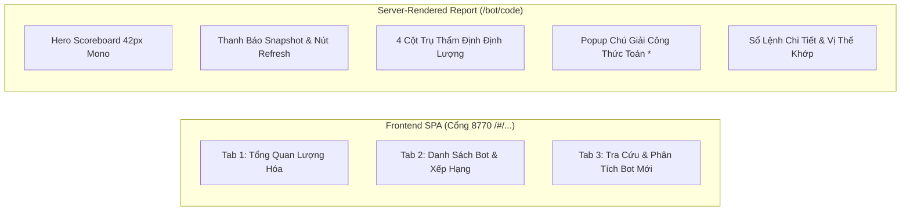

# SPEC-08: KỸ NĂNG GIAO DIỆN QUẢN TRỊ & BÁO CÁO BOT CHUẨN FINTECH

> **BMAD Document Standard**  
> **Document ID:** SPEC-08  
> **Skill Name:** Institutional UI & Financial Visualization Skill  
> **Design Identity:** NORA // ELITE OKX AI TRADING SYSTEM  
> **Type:** TECHNICAL CAPABILITY SPECIFICATION  
> **Status:** APPROVED / PRODUCTION  
> **Version:** 2.3.0  
> **Target Surface:** `Agent/frontend/`, `Agent/frontend/tokens.css`, `Agent/backend/web/report_page.py`  
> **Updated:** 2026-09-18  

---

## 1. Tổng Quan & Triết Lý Thiết Kế (Design Philosophy)

Giao diện của NoraBT được thiết kế theo tiêu chuẩn hệ thống thiết kế cao cấp (**Elite UI Design System** từ `docs/UI_DESIGN_SYSTEM_SKILL.md` và `docs/SKILL.md`), lấy cảm hứng trực tiếp từ thị trường đại lý AI của OKX (**OKX AI Agent Marketplace** tại `https://www.okx.ai/agents`).

### Nguyên tắc cốt lõi:
1. **Typography-First & Phân Tầng Chuẩn Mực:**
   - **`Inter`** (`--sans`): Phông chữ chuẩn mực cho giao diện, bảng biểu, thẻ tóm tắt và thanh điều khiển, tối ưu độ sắc nét ở size nhỏ.
   - **`JetBrains Mono`** (`--mono`): Bắt buộc cho toàn bộ số đo tài chính (PnL, AUM, Drawdown), tỷ lệ phần trăm, mã định danh bot và chỉ số rủi ro (`font-variant-numeric: tabular-nums`).
   - **`Space Grotesk`** (`--display`): Dành riêng cho tiêu đề cấp cao và thương hiệu `NORA // BT`.
2. **Bảng Màu Deep Slate Obsidian Hài Hòa:**
   - Mặt nền Canvas (`#0B0F19`) sâu thẳm, không đen tuyền thô ráp.
   - Mặt thẻ Card (`#111726`) nổi bật 1 bậc kết hợp hiệu ứng kính mờ (`backdrop-filter: blur(16px)`).
   - Đường viền mờ cao cấp (`1px solid #1E293B` hoặc `rgba(255, 255, 255, 0.07)`).
   - Đạt chuẩn tương phản WCAG AA (Contrast Ratio ≥ 4.5:1) với chữ trắng sáng ngà `#F8FAFC` và chữ phụ slate `#94A3B8`.
3. **Thang Bo Góc 5 Bậc (Border Radius Hierarchy):**
   - `--radius-xs: 4px`: Badge nhỏ, chip đếm số, tag phân loại.
   - `--radius-sm: 8px`: Nút bấm, ô nhập input, filter chips, category pills.
   - `--radius-md: 12px`: Khối số liệu, dropdown menu, stat tiles.
   - `--radius-lg: 16px`: Thẻ Card chính, block chứa biểu đồ, modal dialog.
   - `--radius-xl: 20px`: Hero container.
4. **Chiều Sâu Không Gian 3 Lớp & Soft Elevation:**
   - Loại bỏ hoàn toàn bóng đổ cứng (hard shadow thô ráp).
   - Áp dụng hệ thống bóng đổ đa tầng mịn (`0 4px 20px -2px rgba(0, 0, 0, 0.35)`).
   - Ánh sáng phát quang nhẹ (Ambient Glow: `0 0 24px rgba(59, 130, 246, 0.18)`).
   - Chuyển động vi mô (Micro-interactions: `transition: all 0.2s cubic-bezier(0.16, 1, 0.3, 1)`).

---

## 2. Hệ Thống Token Thiết Kế (Design Tokens Architecture)

Tệp `Agent/frontend/tokens.css` là **Nguồn Chân Lý Duy Nhất (Single Source of Truth)** cho toàn bộ bảng màu, phông chữ và kích thước của cả Frontend React SPA lẫn Server-rendered Report Page:

```css
:root {
  /* Bảng màu Dark Obsidian thống nhất */
  --ground: #0B0F19;        /* Nền canvas toàn trang */
  --panel: #111726;         /* Nền thẻ Card và Block */
  --panel-2: #161F32;       /* Nền Header Block và Tab Active */
  --panel-3: #1A243B;       /* Nền Badge và Hover */
  --ink: #F8FAFC;           /* Màu chữ chính */
  --ink-2: #94A3B8;         /* Màu chữ phụ / nhãn */
  --ink-3: #64748B;         /* Màu chữ chú giải / mờ */
  --line: #1E293B;          /* Viền 1px chuẩn */
  --line-2: #2B3954;        /* Viền sáng khi active */

  /* Màu sắc dữ liệu tài chính hài hòa */
  --up: #10B981;            /* Xanh ngọc Emerald - An toàn / Khỏe */
  --down: #F43F5E;          /* Đỏ Crimson - Cảnh báo / Veto */
  --amber: #F59E0B;         /* Vàng Amber - Trung vị / Theo dõi */
  --s1: #3B82F6;            /* Xanh Azure OKX - Accent chính */

  /* Thang bo góc 5 bậc */
  --radius-xs: 4px;
  --radius-sm: 8px;
  --radius-md: 12px;
  --radius-lg: 16px;
  --radius-xl: 20px;

  /* Bóng đổ mịn & Ánh sáng phát quang */
  --card-shadow: 0 4px 20px -2px rgba(0, 0, 0, 0.35), 0 1px 3px rgba(0, 0, 0, 0.2);
  --card-shadow-emphasis: 0 8px 30px -4px rgba(0, 0, 0, 0.45), 0 0 0 1px rgba(59, 130, 246, 0.25);
  --glow-primary: 0 0 24px rgba(59, 130, 246, 0.18);
}
```

---

## 3. Các Phân Hệ Giao Diện Cốt Lõi



### 3.1. Phân hệ Tổng quan (Overview Dashboard)
- **4 Thẻ KPI Quant:** Hiển thị Tổng số bot, Số bot bị Veto, Điểm rủi ro trung vị, và Số bot đang lỗ ròng với bo góc 16px, viền mờ và đổ bóng mịn.
- **Biểu đồ Donut Phân Bố Xếp Loại:** Tách rời vòng tròn đồ họa SVG và danh sách chú giải HTML có tương tác bấm lọc tức thì.
- **Thanh Đo Lý Do Veto:** Dạng thanh gauge siêu mỏng **8px**, bo tròn mềm mại (`border-radius: 999px`) với dải màu gradient rose.

### 3.2. Phân hệ Danh mục Bot (Bots Marketplace View)
- **Thanh lọc danh mục một chạm (OKX AI Category Filter Chips):**
  - Tích hợp dãy filter pills bo tròn phong cách OKX AI (`Tất cả`, `Sụt vốn thấp · Tốt`, `Sụt vốn cao · Tốt`, `Sụt vốn cao · Yếu`, `Rủi ro bị che`, `Đang lỗ ròng`).
  - Hiển thị badge số lượng bot tương ứng trên từng chip, bấm vào lọc dữ liệu tức thì không cần tải lại trang.
- **Bảng dữ liệu chuẩn sàn giao dịch:** Phân trang mượt mà, typography `JetBrains Mono` cho số liệu định lượng, thẻ badge xếp loại rủi ro mềm mại.

### 3.3. Phân hệ Tra cứu & Phân tích Bot Mới (Analyze Flow & Agent Card)
- **OKX AI Agent Profile Card (`BotSummaryCard`):**
  - Avatar biểu tượng robot với gradient Cyan-Azure sang trọng.
  - Tên bot, mã định danh kèm tag sàn `OKX CEX · Copy Trading`.
  - Lưới 4 chỉ số tài chính (AUM, PnL, Thứ hạng, Người copy) trong các ô bo góc 12px với số lớn `JetBrains Mono`.
  - Danh mục tài sản giao dịch gắn chip trạng thái (`ĐANG GIAO DỊCH`, `CHỈ ĐANG ÔM`, `ĐÃ RỜI`).
- **Thẻ thông báo trực quan `BOT MỚI TINH`:** Cảnh báo chu trình cào nến và mô phỏng 10.000 kịch bản mất khoảng 8–11 phút, giúp người dùng nắm rõ tiến trình mà không sốt ruột.
- **Thanh tiến độ động (`Progress Bar`):** Cập nhật từng chặng: Nạp sổ lệnh → 10 Lăng kính → Monte Carlo → Hoàn tất.

### 3.4. Trang Báo cáo Chi tiết Bot (`/bot/<code>`)
- **Hero Scoreboard:** 3 khối thẻ bo góc 12px với số đo điểm rủi ro, điểm chất lượng và độ tin cậy hiển thị cỡ lớn 42px font `JetBrains Mono`, viền accent và glow nhẹ.
- **4 Cột Trụ Thẩm Định:** Khối phương pháp luận Stationary Bootstrap, Expected Shortfall, Deflated Sharpe Ratio và thực nghiệm ngoài mẫu với thiết kế thẻ 12px hiện đại.
- **Nhận định chuyên môn AI Quant:** Trình bày trên nền kính mờ dịu mắt, typography dễ đọc, bullet `◆` màu hổ phách sang trọng.
- **Popup Công Thức Kỹ Thuật (`*`):** Di chuột vào bất kỳ tham số nào (Win Rate, Profit Factor, Max Drawdown) để mở popup giải thích công thức toán học và ý nghĩa kinh tế lượng.

---

## 4. Ma Trận Truy Vết Mã Nguồn (Traceability Matrix)

- **Module thực thi:**
  - `Agent/frontend/src/`: Mã nguồn React SPA (Vite bundle).
  - [tokens.css](file:///home/ubuntu/norabt/Agent/frontend/tokens.css): Hệ thống Design Tokens duy nhất.
  - [report_page.py](file:///home/ubuntu/norabt/Agent/backend/web/report_page.py): Render trang báo cáo chi tiết máy chủ.
- **Tệp kiểm thử:**
  - `Agent/none/test/test_report_page.py`: Kiểm thử hiển thị HTML, bảo đảm 99/99 bài test PASS.
  - `Agent/none/test/test_verdict_relabel.py`: Đảm bảo không chứa từ tiếng Anh thô và giữ vững nhãn tiếng Việt chuẩn mực.
