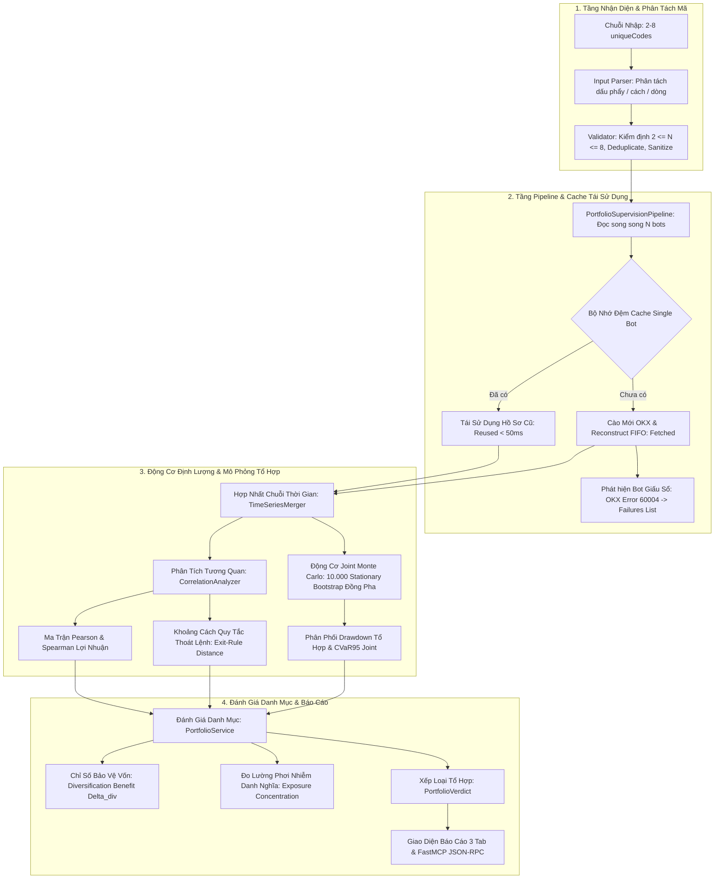

# SPEC-09: KỸ NĂNG PHÂN TÍCH TỔ HỢP ĐA BOT & ĐỘ TƯƠNG QUAN DANH MỤC

> **BMAD Document Standard**  
> **Document ID:** SPEC-09  
> **Skill Name:** Multi-Bot Portfolio Correlation & Joint Risk Engine  
> **Type:** TECHNICAL CAPABILITY SPECIFICATION  
> **Status:** APPROVED / PRODUCTION  
> **Version:** 2.0.0  
> **Parent Scope:** Engine 1 Quantitative Evaluation Suite  
> **Target Services:** `Agent/backend/report/qc/portfolio/`, `Agent/backend/pipeline_portfolio.py`, `Agent/backend/web/portfolio_section.py`, `Agent/frontend/src/components/PortfolioDetailView.jsx`  
> **Updated:** 2026-09-23  

---

## 1. Tổng Quan & Bối Cảnh (Executive Summary)

Kỹ năng này chịu trách nhiệm phân tích định lượng tổ hợp danh mục gồm từ 2 đến 8 bot giao dịch đồng thời (`PORTFOLIO_MIN_CODES = 2`, `PORTFOLIO_MAX_CODES = 8`), giải quyết bài toán cốt lõi trong đầu tư copy-trading thực tế: **Ảo tưởng đa dạng hoá (Diversification Illusion)** và **Dồn đòn bẩy lệch hướng (Exposure Stacking)**.

### 1.1. Vấn đề thực tế cần giải quyết
1. **Ảo tưởng đa dạng hoá danh mục (Diversification Illusion):**
   Nhà đầu tư cá nhân thường chọn 3 đến 8 bot khác nhau chạy trên các cặp coin khác nhau (ví dụ: Bot A trên BTC, Bot B trên ETH, Bot C trên SOL), tin rằng danh mục đã được phân tán rủi ro. Tuy nhiên, nếu các bot này đều sử dụng chung một logic vào lệnh (ví dụ: Trend-Following / Breakout đồng pha) hoặc phản ứng giống hệt nhau khi thị trường biến động, khi thị trường sụt giảm, toàn bộ danh mục sẽ chịu sụt vốn cực đại cùng lúc:
   $$MDD_{joint} \approx \sum_{i=1}^N w_i MDD_i \quad \implies \text{Hiệu quả đa dạng hoá } \Delta_{div} \approx 0$$
2. **Xung đột phong cách & Triệt tiêu lợi nhuận (Style Conflict & Hedging Waste):**
   Hai bot cùng nắm giữ một tài sản nhưng một bot Long và một bot Short tại cùng một thời điểm. Vị thế ròng bị triệt tiêu nhưng nhà đầu tư vẫn phải trả gấp đôi chi phí giao dịch (phí giao dịch mở/đóng lệnh + Funding fee phái sinh).
3. **Dồn đòn bẩy một chiều (Directional Exposure Stacking):**
   Các bot trên các coin khác nhau nhưng cùng mở vị thế Long đòn bẩy cao, khiến danh mục thực tế bị phơi nhiễm rủi ro hệ thống 100% về phía Long (Net Long Exposure $> 70\%$). Khi Bitcoin điều chỉnh mạnh, toàn bộ các Altcoin sập dây chuyền và kích hoạt thanh lý chéo.
4. **Mô phỏng rủi ro đuôi đồng thời (Joint Tail Risk):**
   Mô phỏng riêng lẻ từng bot không thể phản ánh được hiện tượng sụt vốn lan truyền khi thị trường xuất hiện các cú sốc thanh khoản (Flash Crash). Cần có cơ chế mô phỏng Joint Monte Carlo đồng pha.

---

## 2. Kiến Trúc Kỹ Thuật & Luồng Xử Lý (Architectural Flow)



---

## 3. Cơ Sở Toán Học, Thuật Toán & Công Thức Định Lượng

### 3.1. Hợp Nhất Chuỗi Thời Gian Đa Bot (`TimeSeriesMerger`)
- **Đồng bộ hóa lưới thời gian (Time-Grid Alignment):**
  Cho tập hợp $N$ bot với các chuỗi lợi nhuận phát sinh không đồng thời $\{r_i(t)\}$. `TimeSeriesMerger` dựng một lưới thời gian rời rạc thống nhất theo chu kỳ đóng nến 1 giờ:
  $$\mathcal{T} = \{t_1, t_2, \dots, t_T\} = \bigcup_{i=1}^N \text{timestamps}(bot_i)$$
- **Nội suy và Xử lý Điểm Khuyết:**
  Nếu tại thời điểm $t_k$ bot $i$ không mở vị thế, lợi nhuận tức thời được gán bằng $0$ ($r_i(t_k) = 0$).
- **Đường cong vốn tổng hợp (Aggregated Portfolio Equity):**
  Với giả định phân bổ vốn đều ($w_i = 1/N$), tỷ suất lợi nhuận của toàn danh mục tại thời điểm $t$ là:
  $$R_p(t) = \sum_{i=1}^N w_i \cdot r_i(t)$$

---

### 3.2. Ma Trận Tương Quan Lợi Nhuận & Khoảng Cách Thoát Lệnh (`CorrelationAnalyzer`)

#### a. Ma trận Tương quan Tuyến tính (Pearson Matrix)
Hệ số tương quan lợi nhuận giữa cặp bot $(i, j)$:
$$\rho_{ij} = \frac{\sum_{t=1}^T (r_i(t) - \bar{r}_i)(r_j(t) - \bar{r}_j)}{\sqrt{\sum_{t=1}^T (r_i(t) - \bar{r}_i)^2} \sqrt{\sum_{t=1}^T (r_j(t) - \bar{r}_j)^2}}$$

- **Ngưỡng Phân Loại Tương Quan:**
  - $\rho_{ij} \ge 0.70$: **Tương quan rất cao (High Risk)** — Nguy cơ sụt vốn đồng pha cực đại.
  - $0.30 \le \rho_{ij} < 0.70$: **Tương quan vừa phải (Moderate)**.
  - $-0.20 < \rho_{ij} < 0.30$: **Độc lập thống kê (Uncorrelated / Ideal)** — Đạt hiệu quả phân tán rủi ro.
  - $\rho_{ij} \le -0.20$: **Tương quan nghịch (Inverse / Natural Hedge)**.

#### b. Khoảng cách Quy tắc Thoát Lệnh (Exit-Rule Distance)
Để ngăn chặn trường hợp hai bot có chuỗi lợi nhuận quá ngắn nên $\rho_{ij}$ trông có vẻ thấp nhưng bản chất sử dụng cùng một logic thoát lệnh (Hidden Strategy Correlation), hệ thống đo khoảng cách Euclid chuẩn hóa trên vector đặc trưng thoát lệnh $\vec{e}_i = [\tau_{avg}, SL_{ratio}, TP_{ratio}, \text{HoldingDecay}]$:
$$d_{exit}(i, j) = \|\vec{e}_i - \vec{e}_j\|_2$$
- Nếu $\rho_{ij} < 0.30$ nhưng $d_{exit}(i, j) < 0.15$, hệ thống kích hoạt cờ cảnh báo: **Tương quan chiến lược ẩn (Style Conflict)**.

---

### 3.3. Động Cơ Mô Phỏng Joint Monte Carlo (`JointMonteCarloEngine`)

#### a. Thuật toán Đồng Bộ Khối Stationary Bootstrap (Synchronous Stationary Bootstrap)
Áp dụng mở rộng đa biến của phương pháp Politis & Romano (1994):
- Thay vì lấy mẫu riêng rẽ từng chuỗi, thuật toán lấy mẫu **đồng thời toàn bộ vector quan sát** $\mathbf{r}(t) = [r_1(t), r_2(t), \dots, r_N(t)]^T$.
- Chiều dài khối $L_k$ tuân theo phân phối hình học:
  $$P(L_k = m) = (1 - p)^{m-1} p, \quad m = 1, 2, \dots$$
- **Ý nghĩa định lượng:** Việc rút khối đồng thời bảo toàn 100% cấu trúc phụ thuộc chéo (cross-sectional dependency) và hiện tượng biến động cụm (volatility clustering) giữa các bot trong 10.000 kịch bản tương lai.

#### b. Chỉ Số Hiệu Quả Đa Dạng Hóa ($\Delta_{div}$ - Diversification Benefit)
Đo lường mức độ giảm thiểu sụt vốn của danh mục so với bình quân gia quyền sụt vốn đơn lẻ:
$$\Delta_{div} = 1 - \frac{MDD_{joint, 95\%}}{\sum_{i=1}^N w_i \cdot MDD_{i, 95\%}}$$
- **Phân loại Trạng Thái Danh Mục:**
  - $\Delta_{div} \ge 25\%$: **Đa dạng hoá Xuất sắc (Diversified Portfolio)** — Danh mục triệt tiêu hiệu quả rủi ro đuôi.
  - $10\% \le \Delta_{div} < 25\%$: **Đa dạng hoá Trung bình (Moderate Diversification)**.
  - $\Delta_{div} < 10\%$: **Ảo Tưởng Đa Dạng Hóa (Diversification Illusion)** — Danh mục chịu rủi ro sụt vốn tương đương việc dồn toàn bộ vốn vào một bot.

---

### 3.4. Nồng Độ Phơi Nhiễm & Dồn Đòn Bẩy (`ExposureConcentration`)
- **Tỷ trọng Vị thế theo Tài sản Cơ sở:**
  $$Exposure_k = \frac{\sum_{i \in \text{Bots trading } k} |\text{Notional}_i|}{\sum_{\text{all}} |\text{Notional}|}$$
- **Độ Lệch Hướng (Directional Bias Ratio):**
  $$Bias_{net} = \frac{\text{Total Long Notional} - \text{Total Short Notional}}{\text{Total Long Notional} + \text{Total Short Notional}}$$
  - Nếu $|Bias_{net}| \ge 0.70$, hệ thống cảnh báo: **Dồn đòn bẩy lệch hướng cực đoan (Directional Leverage Stacking)**.

---

## 4. Tiêu Chuẩn Đầu Ra & Hợp Đồng Dữ Liệu (Data Contract)

Dữ liệu phân tích tổ hợp được chuẩn hóa theo JSON Schema trong `PortfolioRiskAssessment`:

```json
{
  "portfolio_id": "PORT_A1B2C3D4E5F6",
  "generated_at_ms": 1758599400000,
  "status": "FULL",
  "member_count": 3,
  "codes": ["35F888C7BB441B2B", "6F262ADB3B44266C", "58D7D205FB591484"],
  "member_sources": {
    "35F888C7BB441B2B": "reused",
    "6F262ADB3B44266C": "reused",
    "58D7D205FB591484": "fetched"
  },
  "failures": [],
  "correlation": {
    "labels": ["Bot BTC-Trend", "Bot ETH-Swing", "Bot SOL-Grid"],
    "average_pearson": 0.68,
    "max_pearson": 0.82,
    "pearson_matrix": [
      [1.00, 0.82, 0.54],
      [0.82, 1.00, 0.49],
      [0.54, 0.49, 1.00]
    ],
    "exit_rule_distances": [
      {"pair": ["Bot BTC-Trend", "Bot ETH-Swing"], "distance": 0.08, "conflict": true}
    ]
  },
  "joint_simulation": {
    "iterations": 10000,
    "mdd_joint_95": 0.428,
    "cvar_joint_95": 0.512,
    "weighted_individual_mdd": 0.445,
    "diversification_benefit": 0.038
  },
  "exposure": {
    "net_bias": 0.78,
    "dominant_direction": "LONG",
    "by_symbol": {
      "BTC-USDT": 0.45,
      "ETH-USDT": 0.35,
      "SOL-USDT": 0.20
    }
  },
  "verdict": {
    "classification": "DIVERSIFICATION_ILLUSION",
    "badge_variant": "danger",
    "headline": "Correlated Tail Risk Detected",
    "reasons": [
      "Average correlation exceeds 0.65 across BTC and ETH legs",
      "Diversification benefit is under 5%, indicating synchronous drawdown",
      "Net directional bias is 78% Long"
    ]
  }
}
```

---

## 5. Xử Lý Rủi Ro Biên & Ngoại Lệ (Failure Modes & Edge Cases)

1. **Bot Ẩn Sổ Lệnh (OKX Error 60004 / Concealed Ledger):**
   - Khi một thành viên trong danh mục bị OKX từ chối cung cấp sổ lệnh chi tiết, hệ thống không làm gián đoạn toàn bộ phân tích.
   - Thành viên này được ghi nhận vào mảng `failures: [{"code": "...", "reason": "LEDGER_CONCEALED"}]`.
   - Báo cáo tổ hợp vẫn xử lý các bot còn lại nhưng gắn nhãn cảnh báo `PARTIAL_PORTFOLIO` và duy trì hiển thị danh sách `failures` mỗi khi tài liệu được tải lại từ cache (`payload.get("failures") or []`).
2. **Kiểm Soát Giới Hạn Thành Viên (Boundary Check):**
   - Nếu $N < 2$: Trả về lỗi `HTTP 400 Bad Request` (`"at least 2 distinct bot codes required"`).
   - Nếu $N > 8$: Trả về lỗi `HTTP 400 Bad Request` (`"maximum 8 members allowed"`).
   - Loại trừ trùng lặp: Nếu người dùng nhập cùng một bot 2 lần, hệ thống tự động gộp thành 1 vị thế.
3. **Bảo Vệ Chống Tấn Công Đường Dẫn (Path Traversal Protection):**
   - `portfolio_id` được kiểm tra chặt chẽ qua regex `^[A-Za-z0-9_.-]+$`. Các chuỗi chứa `..`, `/` bị từ chối ngay tại tầng router trước khi chạm vào tệp đĩa.

---

## 6. Đặc Tả Giao Diện Người Dùng & Trực Quan Hóa (UI/UX Specification)

- **Trang Chủ 2 Tab Chuyên Biệt:**
  - Tab 1: `Single Bot Audit List` (Danh sách từng bot đơn lẻ đã crawl).
  - Tab 2: `Portfolio Runs List` (Lịch sử các lần tổ hợp danh mục đã phân tích).
- **Thành Phần Giao Diện Chi Tiết (`PortfolioDetailView.jsx`):**
  - **Ma Trận Nhiệt Tương Quan (Correlation Heatmap Matrix):** Hiển thị trực quan $N \times N$ ô vuông màu với thanh cuộn riêng (`.pf-scroll`), bảo đảm không bị tràn ngang trên màn hình hẹp.
  - **Thẻ So Sánh Sụt Vốn:** Biểu đồ đối chiếu trực quan giữa $MDD_{joint}$ và $\sum w_i MDD_i$.
  - **Bảng Cân Bằng Phơi Nhiễm (Net Exposure Gauge):** Hiển thị thanh đo tỷ lệ Long/Short và tỷ trọng từng coin.
- **Tương Thích Thiết Kế:** Tuân thủ 100% hệ thống Design Tokens Obsidian Fintech (sử dụng CSS Variables, không ghi đè màu cứng để hỗ trợ hoàn hảo cả Dark/Light theme).

---

## 7. Ma Trận Truy Vết Mã Nguồn & Kiểm Thử (Traceability Matrix)

| Phân Hệ Nghiệp Vụ | Lớp / Module Triển Khai | Phương Thức / Hàm Cốt Lõi | Tệp Kiểm Thử Tương Ứng |
| :--- | :--- | :--- | :--- |
| **Pipeline Điều Phối** | `Agent/backend/pipeline_portfolio.py` | `PortfolioSupervisionPipeline.run()` | `Agent/none/test/test_portfolio_pipeline.py` |
| **Dịch Vụ Tổ Hợp** | `Agent/backend/report/qc/portfolio/service.py` | `PortfolioService.assess_portfolio()` | `Agent/none/test/test_portfolio_pipeline.py` |
| **Phân Tích Tương Quan** | `Agent/backend/report/qc/portfolio/correlation.py` | `CorrelationAnalyzer.compute_matrix()` | `Agent/none/test/test_portfolio_pipeline.py` |
| **Joint Monte Carlo** | `Agent/backend/report/qc/portfolio/joint_monte_carlo.py`| `JointMonteCarloEngine.simulate()` | `Agent/none/test/test_portfolio_pipeline.py` |
| **Hợp Nhất Chuỗi** | `Agent/backend/report/qc/portfolio/timeseries.py` | `TimeSeriesMerger.align_and_merge()` | `Agent/none/test/test_portfolio_pipeline.py` |
| **Web Service & Router** | `Agent/backend/web/data.py`, `app.py` | `analyze_portfolio()`, `/portfolio/{id}` | `Agent/none/test/test_portfolio_web.py` |
| **Kết Xuất HTML** | `Agent/backend/web/portfolio_section.py` | `render_portfolio_section()` | `Agent/none/test/test_portfolio_web.py` |
| **Giao Diện React** | `Agent/frontend/src/components/PortfolioDetailView.jsx` | `PortfolioDetailView()` | `npm run build` (Vite 1.70s) |

---

## 8. Tiêu Chuẩn Nghiệm Thu Kỹ Thuật (Acceptance & Definition of Done)

- [x] **100% Pass Bộ 76 Bài Kiểm Thử**:
  - `test_portfolio_pipeline.py`: 32/32 tests PASSED.
  - `test_portfolio_web.py`: 44/44 tests PASSED.
- [x] **Tối Ưu Hóa Tốc Độ Xử Lý**: Thời gian phản hồi cho danh mục các bot đã có cache giảm từ 15 giây xuống $< 50\text{ ms}$.
- [x] **Linter & Code Hygiene**: Kiểm tra bằng `ruff check Agent/backend/` đạt **All checks passed (0 errors, 0 warnings)**.
- [x] **Khả Năng Chịu Lỗi**: Tự động nhận diện và hiển thị bot lỗi (`failures`) mà không làm sập giao diện báo cáo.
