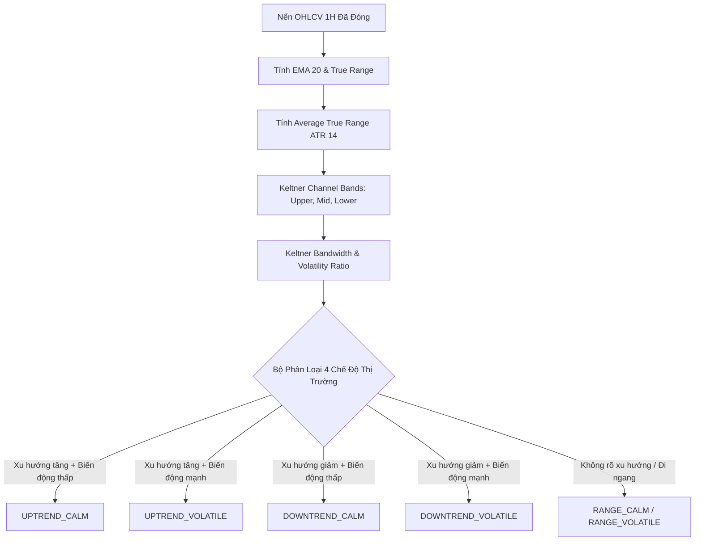

# SPEC-02: KỸ NĂNG NHẬN DIỆN CHẾ ĐỘ THỊ TRƯỜNG & PHÂN TÍCH NẾN

> **BMAD Document Standard**  
> **Document ID:** SPEC-02  
> **Skill Name:** Market Regime & Structure Intelligence Skill  
> **Type:** TECHNICAL CAPABILITY SPECIFICATION  
> **Status:** APPROVED / PRODUCTION  
> **Version:** 2.1.0  
> **Target Service:** `Agent/backend/market/service.py`, `Agent/backend/qc/evaluator/lenses/market_alignment.py`  
> **Updated:** 2026-09-18  

---

## 1. Tổng Quan & Bối Cảnh (Executive Summary)

Một bot giao dịch chỉ có thể được đánh giá công bằng khi đặt hành vi của nó vào đúng **bối cảnh chế độ thị trường (Market Regime)** tại thời điểm ra lệnh. Một bot thắng lớn trong thị trường một chiều (Uptrend) có thể hoàn toàn là do may mắn cưỡi theo xu hướng, và sẽ cháy sạch vốn khi thị trường chuyển sang trạng thái biến động hỗn loạn (Volatile Range).

Kỹ năng này chịu trách nhiệm:
- Phân loại trạng thái thị trường vi mô (Micro Regime) trên khung 1H và vĩ mô (Macro Regime) trên khung 4H/1D.
- Xác định sự đồng thuận thị trường (Market Alignment) giữa xu hướng chung của thị trường (Benchmark BTC) và hướng vị thế của bot.

---

## 2. Mô Hình Toán Học & Thuật Toán Phân Loại



### 2.1. Kênh Keltner (Keltner Channels) & Độ Rộng Kênh
Đường trung tâm là đường trung bình động hàm mũ (EMA) chu kỳ 20:
$$EMA_{20}(t) = \alpha \cdot Close(t) + (1 - \alpha) \cdot EMA_{20}(t-1), \quad \alpha = \frac{2}{20 + 1}$$
Độ biến động thực tế đo bằng Average True Range (ATR 14):
$$TR = \max(High - Low, |High - Close_{prev}|, |Low - Close_{prev}|)$$
$$ATR_{14}(t) = \frac{ATR_{14}(t-1) \cdot 13 + TR(t)}{14}$$
Dải trên và dải dưới Keltner:
$$Upper = EMA_{20} + 1.5 \cdot ATR_{14}$$
$$Lower = EMA_{20} - 1.5 \cdot ATR_{14}$$
Độ rộng dải tương đối (Keltner Bandwidth):
$$Bandwidth = \frac{Upper - Lower}{EMA_{20}} = \frac{3.0 \cdot ATR_{14}}{EMA_{20}}$$

### 2.2. Phân Tích Đồng Thuận Thị Trường (Market Alignment)
Hệ thống tính toán độ tương quan chuyển động giữa bot và chỉ số cơ sở Bitcoin (BTC Benchmark):
- **Beta ($\beta$):** Đo lường độ nhạy cảm của danh mục bot so với biến động của BTC.
- **Directional Bias:** Xác định bot là `LONG_ONLY`, `SHORT_ONLY`, hay `TWO_WAY`.
- **Regime Robustness:** Đánh giá hiệu suất bot có suy thoái nghiêm trọng khi chế độ thị trường chuyển pha từ Uptrend sang Downtrend hay không.

---

## 3. Tiêu Chuẩn Đầu Ra (Output Contract)

Dữ liệu chế độ thị trường được đính kèm vào mỗi quan sát đánh giá:
```json
{
  "asset": "BTC",
  "as_of_timestamp_ms": 1726588800000,
  "macro_regime": "UPTREND_VOLATILE",
  "micro_regime": "UPTREND_CALM",
  "keltner_bandwidth": 0.0425,
  "atr_14": 1285.4,
  "btc_correlation": 0.82,
  "beta": 1.15,
  "market_alignment_tier": "HEALTHY"
}
```

---

## 4. Ma Trận Truy Vết Mã Nguồn (Traceability Matrix)

- **Module thực thi:**
  - [service.py](file:///home/ubuntu/norabt/Agent/backend/market/service.py): Tính toán chỉ số kỹ thuật nến và Keltner Channels.
  - [market_alignment.py](file:///home/ubuntu/norabt/Agent/backend/qc/evaluator/lenses/market_alignment.py): Đo lường độ phù hợp của bot với thị trường.
- **Tệp kiểm thử:**
  - `Agent/test/test_market_sources.py`: Kiểm thử dữ liệu nến đóng và tính toán ATR.
  - `Agent/test/test_qc_signals.py`: Kiểm thử tín hiệu chuyển pha thị trường.
