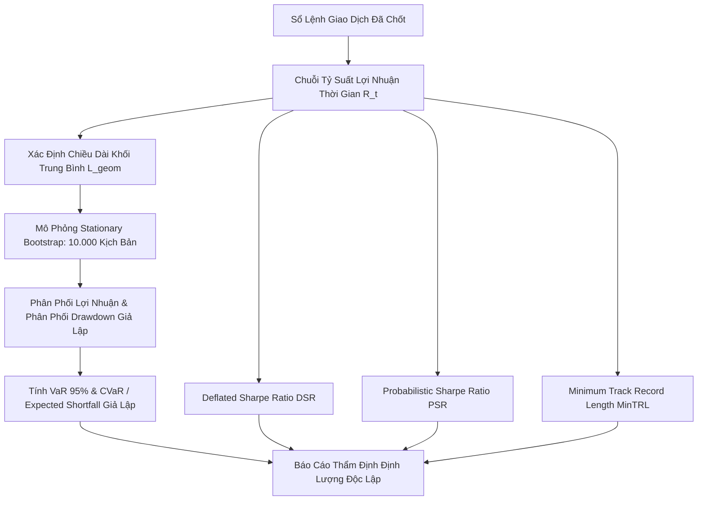

# SPEC-04: KỸ NĂNG MÔ PHỎNG MONTE CARLO & BOOTSTRAP THỐNG KÊ

> **BMAD Document Standard**  
> **Document ID:** SPEC-04  
> **Skill Name:** Monte Carlo Simulation & Stationary Bootstrap Skill  
> **Type:** TECHNICAL CAPABILITY SPECIFICATION  
> **Status:** APPROVED / PRODUCTION  
> **Version:** 2.2.0  
> **Target Service:** `Agent/backend/mcp/analytics/simulation/`  
> **Updated:** 2026-09-18  

---

## 1. Tổng Quan & Bối Cảnh (Executive Summary)

Một chuỗi lịch sử giao dịch trong quá khứ chỉ là **MỘT trong vô số hiện thực khả dĩ** mà thị trường đã diễn ra. Nếu chỉ nhìn vào đường cong vốn (equity curve) duy nhất đó, nhà đầu tư rất dễ bị đánh lừa bởi tính ngẫu nhiên (trúng một chuỗi may mắn).

Kỹ năng này triển khai **Mô phỏng Monte Carlo 10.000 kịch bản bằng phương pháp Stationary Bootstrap (Politis & Romano, 1994)** nhằm khảo sát toàn diện không gian phân phối xác suất của chiến lược trong tương lai, kết hợp với các lý thuyết kinh tế lượng tài chính hiện đại của Marcos López de Prado.

---

## 2. Nền Tảng Lý Thuyết & Công Thức Toán Học



### 2.1. Thuật Toán Stationary Bootstrap (Politis & Romano, 1994)
Khác với phương pháp xáo trộn độc lập (IID Resampling) phá hủy cấu trúc tương quan chuỗi (autocorrelation và volatility clustering), **Stationary Bootstrap** lấy mẫu lại theo các khối có độ dài ngẫu nhiên tuân theo phân phối hình học:
$$P(L = k) = (1 - p)^{k-1} p, \quad k = 1, 2, \dots$$
Trong đó:
- Kỳ vọng chiều dài khối $E[L] = 1/p$.
- Phương pháp này đảm bảo tính dừng (stationarity) của chuỗi thời gian được bảo tồn nguyên vẹn qua 10.000 kịch bản tái tạo.

### 2.2. Expected Shortfall (CVaR 95%)
Đo lường mức sụt giảm kỳ vọng trong phần đuôi rủi ro cực đoan nhất:
$$CVaR_\alpha = E[X \mid X \le VaR_\alpha] = \frac{1}{1 - \alpha} \int_0^{1-\alpha} VaR_u \, du$$
Với $\alpha = 0.95$, chỉ số này trả lời câu hỏi: *"Nếu kịch bản xấu 5% xảy ra, bot sẽ gây cháy bao nhiêu phần trăm tài khoản?"*

### 2.3. Deflated Sharpe Ratio (DSR) & Probabilistic Sharpe Ratio (PSR)
Theo nghiên cứu của Bailey & López de Prado (2012, 2014):
Sharpe Ratio danh nghĩa thường bị thổi phồng do hiện tượng thử nghiệm nhiều lần (Multiple Testing) và dữ liệu có độ lệch (skewness), độ nhọn (kurtosis).

Công thức Probabilistic Sharpe Ratio (PSR):
$$PSR(SR^*) = Z\left[ \frac{(\widehat{SR} - SR^*) \sqrt{N-1}}{\sqrt{1 - \widehat{\gamma}_3 \widehat{SR} + \frac{\widehat{\gamma}_4 - 1}{4} \widehat{SR}^2}} \right]$$
Trong đó:
- $\widehat{\gamma}_3$ là hệ số bất đối xứng (Skewness).
- $\widehat{\gamma}_4$ là hệ số độ nhọn (Kurtosis).
- $N$ là số lượng quan sát giao dịch.

Công thức Deflated Sharpe Ratio (DSR) hiệu chỉnh trần kỳ vọng Sharpe tối đa khi đã thử qua $K$ chiến lược:
$$SR^* = \sqrt{2 \ln(K)} \left(1 - \frac{\gamma}{\sqrt{2 \ln(K)}}\right) + \dots$$
DSR đo lường xác suất thực sự rằng chiến lược có Sharpe dương sau khi trừ đi toàn bộ lợi thế giả tạo từ việc tối ưu hóa quá mức.

### 2.4. Thời Lượng Dữ Liệu Tối Thiểu (MinTRL)
Xác định số năm hoặc số lệnh tối thiểu cần thiết để xác nhận thống kê có độ tin cậy 95%:
$$MinTRL = 1 + \left[ 1 - \widehat{\gamma}_3 \widehat{SR} + \frac{\widehat{\gamma}_4 - 1}{4} \widehat{SR}^2 \right] \left( \frac{Z_\alpha}{\widehat{SR}} \right)^2$$

---

## 3. Tiêu Chuẩn Đầu Ra (Output Contract)

Dữ liệu mô phỏng được cấu trúc trong `monte_carlo.json`:
```json
{
  "scenarios_count": 10000,
  "methodology": "Politis_Romano_1994_Stationary_Bootstrap",
  "var_95_drawdown": 0.284,
  "cvar_95_expected_shortfall": 0.412,
  "median_cagr": 0.345,
  "sharpe_nominal": 1.82,
  "sharpe_deflated": 1.15,
  "probabilistic_sharpe_ratio": 0.94,
  "min_track_record_days": 84,
  "actual_track_record_days": 165
}
```

---

## 4. Ma Trận Truy Vết Mã Nguồn (Traceability Matrix)

- **Module thực thi:**
  - [monte_carlo.py](file:///home/ubuntu/norabt/Agent/backend/mcp/analytics/simulation/monte_carlo.py): Mô phỏng Monte Carlo.
  - [bootstrap.py](file:///home/ubuntu/norabt/Agent/backend/mcp/analytics/simulation/bootstrap.py): Thuật toán Stationary Bootstrap.
  - [inference.py](file:///home/ubuntu/norabt/Agent/backend/mcp/analytics/simulation/inference.py): Tính DSR, PSR và MinTRL.
- **Tệp kiểm thử:**
  - `Agent/test/test_sharpe_inference.py`: Kiểm thử DSR và tính toán phân phối thống kê.
  - `Agent/test/test_performance_formulas.py`: Kiểm tra độ chính xác công thức toán.
