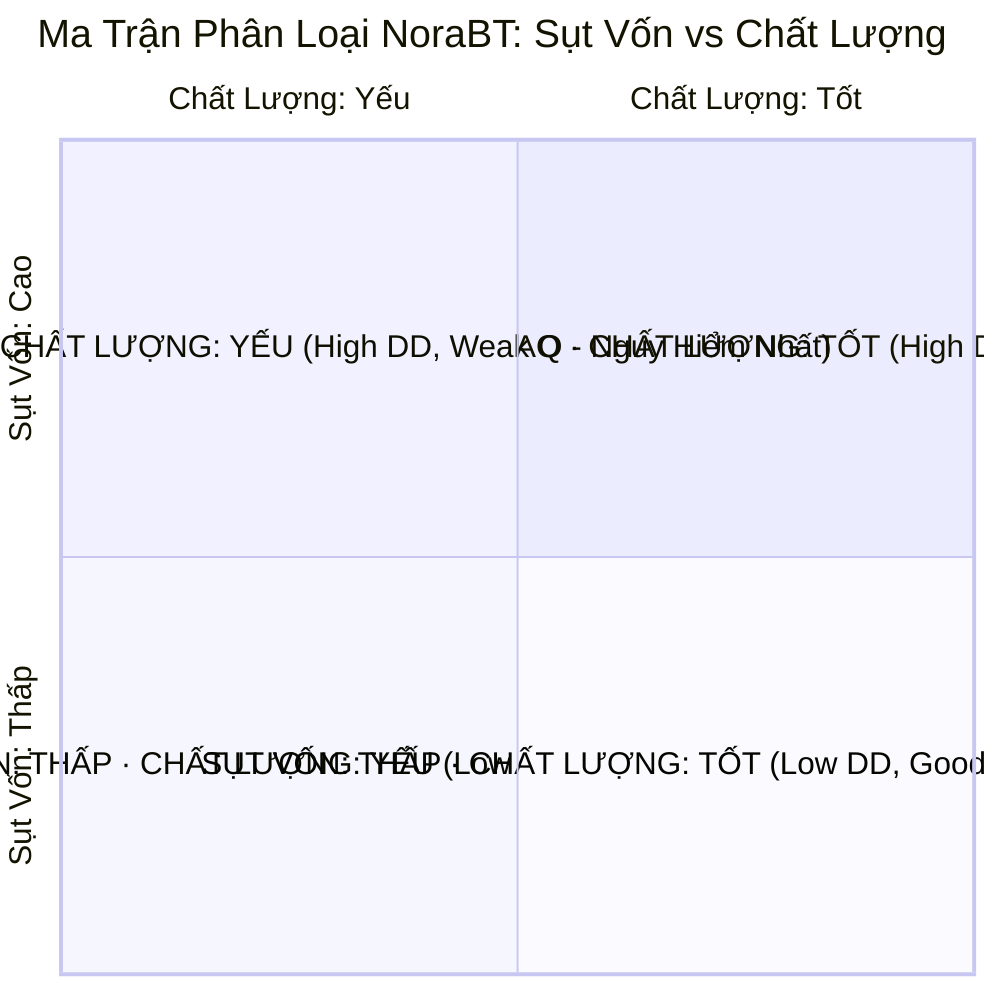

# SPEC-05: KỸ NĂNG VETO AN TOÀN & XẾP LOẠI CHẤT LƯỢNG

> **BMAD Document Standard**  
> **Document ID:** SPEC-05  
> **Skill Name:** Safety Veto & Verdict Decision Engine Skill  
> **Type:** TECHNICAL CAPABILITY SPECIFICATION  
> **Status:** APPROVED / PRODUCTION  
> **Version:** 2.3.0  
> **Target Service:** `Agent/backend/qc/scoring/verdict.py`, `Agent/backend/qc/reporting/reasons.py`  
> **Updated:** 2026-09-18  

---

## 1. Tổng Quan & Bối Cảnh (Executive Summary)

Mục tiêu tối thượng của NoraBT là **Bảo vệ Vốn cho Nhà Đầu Tư (Copier Capital Protection)**. Do đó, hệ thống không chỉ chấm một điểm số chung chung mà áp dụng cơ chế **Veto Cứng (Hard Veto)**: Bất kể một bot có tỷ suất PnL cao đến đâu hay từng thắng bao nhiêu trận, chỉ cần phạm phải một trong các hành vi nguy hiểm chết người, bot đó sẽ lập tức bị Veto và cảnh báo đỏ toàn diện.

Kỹ năng này triển khai:
1. **Bộ 6 Tiêu Chí Veto Cứng** bảo vệ an toàn danh mục.
2. **Ma Trận Phân Loại 4 Góc Phần Tư (The 4-Quadrant Verdict)**.
3. **Bộ 3 Chỉ Số Đo Thẩm Định:** Điểm Rủi Ro (Risk Score), Điểm Chất Lượng (Quality Score) và Độ Tin Cậy (Confidence Score).

---

## 2. Ma Trận Phân Loại 4 Góc Phần Tư (4-Quadrant Verdict)

### Các nhóm xếp loại:
1. **SỤT VỐN: THẤP · CHẤT LƯỢNG: TỐT (Màu Xanh Ngọc - `--verdict-low-dd-good-q`):**
   - Chiến lược bền vững, kiểm soát rủi ro chặt chẽ, lợi nhuận đến từ lợi thế cạnh tranh thực sự.
2. **SỤT VỐN: THẤP · CHẤT LƯỢNG: YẾU (Màu Xanh Biển - `--verdict-low-dd-weak-q`):**
   - Rủi ro sụt vốn không quá lớn nhưng hiệu suất sinh lời nghèo nàn, biên độ lợi nhuận mỏng.
3. **SỤT VỐN: CAO · CHẤT LƯỢNG: TỐT (Màu Hổ Phách - `--verdict-high-dd-good-q`):**
   - Lợi nhuận cao nhưng đường cong vốn giằng co mạnh, chỉ dành cho nhà đầu tư chịu được biến động lớn.
4. **SỤT VỐN: CAO · CHẤT LƯỢNG: YẾU (Màu Đỏ Hồng - `--verdict-high-dd-weak-q`):**
   - Chiến lược cực kỳ nguy hiểm, sụt vốn sâu nhưng lợi nhuận không bù đắp được rủi ro.
5. **RỦI RO BỊ CHE (Màu Tím - `--verdict-hidden-risk`):**
   - Bot có dấu hiệu gồng lỗ, giấu lệnh âm, hoặc giao dịch chưa đủ thời gian để lộ điểm yếu.
6. **THIẾU BẰNG CHỨNG (Màu Xám - `--verdict-unknown`):**
   - Dữ liệu quá ngắn (< 30 lệnh hoặc < 14 ngày), hệ thống từ chối đưa ra kết luận tích cực.

---

## 3. Bộ 6 Tiêu Chí Veto Cứng (Hard Safety Veto Rules)

| Mã Tiêu Chí | Tên Tiêu Chuẩn Veto | Điều Kiện Kích Hoạt | Ý Nghĩa Tài Chính |
| :---: | :--- | :--- | :--- |
| **VETO-01** | **Kịch bản stress dẫn tới thanh lý** | $CVaR_{95\%} \ge 85\%$ hoặc $MDD_{sim} \ge 90\%$ | Trong mô phỏng 10.000 kịch bản, có xác suất cao bot sẽ bị thanh lý cưỡng bức cháy sạch vốn. |
| **VETO-02** | **Rủi ro đuôi mô phỏng cực đoan** | $VaR_{95\%} \ge 60\%$ trong 3 chu kỳ liên tiếp | Phân phối lợi nhuận lệch âm nặng nề, rủi ro thiên nga đen quá lớn. |
| **VETO-03** | **Hành vi giao dịch hủy hoại** | Tỷ lệ nhồi lệnh Martingale $> 3$ bậc hoặc gồng lỗ $> 72$h | Bot không có kỷ luật cắt lỗ, dùng đòn bẩy tăng dần để cứu lệnh âm. |
| **VETO-04** | **Chốt hết sổ mở thì Profit Factor $< 0.60$** | $PF_{adjusted} < 0.60$ khi tính cả lệnh đang ôm | Lợi nhuận danh nghĩa là giả tạo, nếu đóng toàn bộ vị thế đang mở thì tài khoản âm nặng. |
| **VETO-05** | **Đòn bẩy vượt trần an toàn sàn** | Leverage $> 15x$ trên Altcoin hoặc $> 30x$ trên BTC | Đòn bẩy cao kết hợp biến động giật râu của crypto chắc chắn dẫn tới quét thanh lý. |
| **VETO-06** | **Suy thoái hoàn toàn khi đổi pha** | Lợi nhuận âm $> 35\%$ ngay khi rời khỏi pha Uptrend | Bot chỉ chạy được trong một chiều thị trường, hoàn toàn tê liệt khi thị trường đổi pha. |

---

## 4. Công Thức Tính Toán 3 Điểm Số Thẩm Định

### 4.1. Điểm Rủi Ro (Risk Score: 0 – 100)
Càng thấp càng an toàn. Là tổ hợp tuyến tính có trọng số từ 10 lăng kính rủi ro:
$$RiskScore = \sum_{i=1}^{10} w_i \cdot LensScore_i$$
Trong đó các lăng kính rủi ro đuôi, sụt vốn và đòn bẩy chiếm trọng số lớn nhất ($w_{drawdown} = 0.20, w_{tail} = 0.15, w_{leverage} = 0.15$). Nếu bị VETO, điểm rủi ro tự động bị nâng lên tối đa ($\ge 85$).

### 4.2. Điểm Chất Lượng (Quality Score: 0 – 100)
Càng cao càng tốt. Đo lường tỷ suất sinh lời vượt trội trên mỗi đơn vị rủi ro sau khi đã trừ đi yếu tố may mắn qua chỉ số Deflated Sharpe.

### 4.3. Độ Tin Cậy (Confidence Score: 0% – 100%)
Đo lường độ vững chắc của kết luận dựa trên kích thước mẫu dữ liệu:
$$Confidence = f(TotalTrades, TrackRecordDays, DataFreshness, MinTRLRatio)$$
Nếu bot mới chạy vài ngày, độ tin cậy chỉ đạt 20–40%, khuyến nghị người dùng không vội vã copy số vốn lớn.

---

## 5. Ma Trận Truy Vết Mã Nguồn (Traceability Matrix)

- **Module thực thi:**
  - [verdict.py](file:///home/ubuntu/norabt/Agent/backend/qc/scoring/verdict.py): Thuật toán phân loại và xác định điểm số.
  - [reasons.py](file:///home/ubuntu/norabt/Agent/backend/qc/reporting/reasons.py): Quy tắc Veto và mã hóa nguyên nhân.
- **Tệp kiểm thử:**
  - `Agent/test/test_quality_verdict.py`: Kiểm thử phân loại 4 góc phần tư.
  - `Agent/test/test_verdict_horizon.py`: Kiểm tra tính bền vững của xếp loại qua các khung thời gian.
