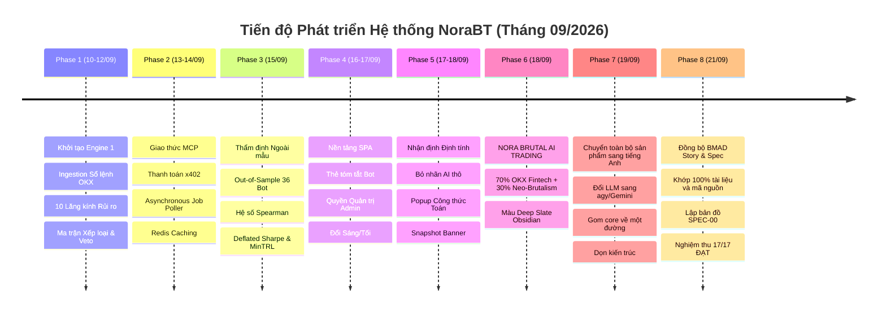

# STORY-00: QUÁ TRÌNH VÀ TIẾN ĐỘ PHÁT TRIỂN HỆ THỐNG NORABT

> **BMAD Document Standard**  
> **Document ID:** STORY-00  
> **Type:** SYSTEM LIFECYCLE & PROGRESSION STORY  
> **Status:** ACTIVE / OPERATIONAL  
> **Methodology Version:** 2.4.0  
> **Parent Scope:** NoraBT AI Risk Supervisor & Copier Guard  
> **Updated:** 2026-09-21  

---

## 1. Mục Đích và Phạm Vi (Purpose & Boundary)

Tài liệu này ghi lại toàn bộ **quá trình, tiến độ và hiện trạng phát triển** của hệ thống **NoraBT** (Hệ thống Giám sát Rủi ro Định lượng & Thẩm định Bot Copy-trading trên sàn OKX).

Mục tiêu:
- Cung cấp bức tranh toàn cảnh về lộ trình kỹ thuật từ khởi tạo đến vận hành thực tế.
- Theo dõi tiến độ từng chặng (Phases), các rào cản kỹ thuật đã vượt qua và các tiêu chuẩn kiểm thử đã đạt được.
- Đóng vai trò làm nguồn sự thật (Source of Truth) cho ban quản trị và đội ngũ kỹ sư để nắm rõ tình hình hệ thống tại mọi thời điểm.

---

## 2. Dòng Thời Gian & Các Giai Đoạn Phát Triển (Phase Progression)

---

### Giai Đoạn 1: Xây dựng Nền tảng Lượng hóa & Engine 1 (10/09 - 12/09/2026)
- **Bối cảnh:** Dữ liệu copy-trading trên các sàn tập trung (CEX) thường bị nhiễu bởi PnL danh nghĩa, che giấu các cú sụt vốn (drawdown) sâu hoặc kỹ thuật gồng lỗ nguy hiểm (Martingale, om vị thế không đặt stop-loss).
- **Hành động đã hoàn thành:**
  - Xây dựng module nạp dữ liệu lịch sử lệnh từ OKX (`trade_list.json`, `overview.json`).
  - Xây dựng động cơ tái tạo sổ lệnh và tính toán vị thế khớp lệnh theo chuẩn FIFO.
  - Thiết lập **10 lăng kính rủi ro lượng hóa độc lập** (`drawdown_risk`, `tail_risk`, `leverage_exposure`, `behavioral_risk`, `strategy_drift`, `liquidity_execution`, `portfolio_risk`, `performance_quality`, `return_r_quality`, `market_alignment`).
  - Xây dựng ma trận phân loại 4 góc phần tư: Sụt vốn (Cao/Thấp) × Chất lượng (Tốt/Yếu).
  - Thiết lập 6 tiêu chí **Veto An toàn** cứng nhằm lập tức cảnh báo các bot có nguy cơ cháy tài khoản.

---

### Giai Đoạn 2: Chuẩn hóa Giao thức MCP & Thanh toán Vi mô x402 (13/09 - 14/09/2026)
- **Bối cảnh:** Cần mở rộng năng lực thẩm định của Nora thành một Agent Service có thể tích hợp vào hệ sinh thái AI của OKX (OKX AI Marketplace) và cho phép các AI Agent khác truy vấn dữ liệu.
- **Hành động đã hoàn thành:**
  - Triển khai máy chủ **MCP Server (Model Context Protocol)** trên nền JSON-RPC 2.0.
  - Công bố 6 công cụ: `list_assets`, `list_bots`, `list_assessed_bots`, `get_assessment`, `assess_bot`, `get_market` (đối chiếu `@mcp.tool()` trong `Agent/backend/scripts/agent_server.py`).
  - Thiết kế cơ chế thanh toán vi mô **chuẩn x402** qua USDC trên mạng X Layer của OKX, bảo đảm tính minh bạch và kinh tế học token (Agent Economy).
  - Tích hợp lớp đệm **Redis Cache** (`norabt-agent-redis`) để tối ưu thời gian phản hồi từ 5s xuống dưới 50ms cho các truy vấn đọc lại.

---

### Giai Đoạn 3: Thẩm định Ngoài Mẫu (Out-of-Sample Validation) & Kiểm chuẩn Thống kê (15/09/2026)
- **Bối cảnh:** Điểm số rủi ro không được mang tính suy đoán chủ quan mà phải được chứng minh bằng thực nghiệm toán học tài chính.
- **Hành động đã hoàn thành:**
  - Tiến hành thử nghiệm ngoài mẫu trên **36 bot thực tế** hoạt động trên sàn OKX.
  - Đo lường hệ số tương quan hạng **Spearman Rank Correlation** giữa điểm rủi ro và mức sụt vốn thực tế về sau, đạt kết quả thống kê có ý nghĩa cao.
  - Ứng dụng mô hình **Deflated Sharpe Ratio (DSR)** và **Probabilistic Sharpe Ratio (PSR)** theo nghiên cứu của GS. Marcos López de Prado (2014) nhằm triệt tiêu thiên lệch chọn mẫu (selection bias) và hiện tượng overfitting do backtest nhiều lần.
  - Bổ sung chỉ số **Minimum Track Record Length (MinTRL)** để xác định thời lượng dữ liệu tối thiểu cần thiết trước khi kết luận một bot có thực tài hay chỉ may mắn.

---

### Giai Đoạn 4: Hiện đại hóa Giao diện Quản trị viên (Admin SPA) (16/09 - 17/09/2026)
- **Bối cảnh:** Bảng điều khiển cũ dùng HTML tĩnh thiếu tính tương tác, khó theo dõi biến động danh mục và quản lý tiến độ phân tích bot mới.
- **Hành động đã hoàn thành:**
  - Chuyển đổi toàn bộ giao diện quản trị sang **React Single-Page Application (SPA)** dùng Vite, React Router DOM và kiến trúc Hash Routing tương thích môi trường containerized.
  - Xây dựng 3 phân hệ chính:
    1. **Tổng quan (Overview):** 4 thẻ KPI lượng hóa, biểu đồ Donut phân bố xếp loại rủi ro, biểu đồ cột phân bố điểm số và danh sách lý do Veto nổi bật.
    2. **Danh sách Bot (Bot Directory):** Bảng dữ liệu mật độ cao, hỗ trợ sắp xếp theo rủi ro, chất lượng, độ tin cậy và tìm kiếm tức thì.
    3. **Tra cứu & Phân tích Bot Mới (Analyze Flow):** Cho phép nhập mã bot OKX bất kỳ để hệ thống tự động cào nến, phân tích sổ lệnh, chạy Monte Carlo và trả kết quả.
  - Đồng bộ cơ chế phân quyền Quản trị viên (`NORABT_ADMIN_OPEN_ACCESS=true` hoặc session cookie).

---

### Giai Đoạn 5: Tích hợp Nhận định Chuyên môn Định tính & Bổ sung Công thức (17/09 - 18/09/2026)
- **Bối cảnh:** Người dùng cần hiểu sâu sắc nguyên nhân cốt lõi tại sao bot bị đánh giá kém hoặc bị veto, thay vì chỉ nhìn vào một con số rủi ro trơ trọi.
- **Hành động đã hoàn thành:**
  - Tích hợp động cơ sinh **Nhận định Chuyên môn (Narrative Synthesizer)** tự động trích xuất bằng chứng thực tế từ sổ lệnh và phân tích hành vi.
  - Cấu trúc nhận định chặt chẽ: **KẾT LUẬN TỔNG QUAN → NGUYÊN NHÂN CỐT LÕI → BẰNG CHỨNG XÁC THỰC (`◆`)**.
  - Loại bỏ hoàn toàn các nhãn gợi ý máy móc ("Claude 3.5 Sonnet") để đảm bảo tính khách quan chuyên nghiệp của hệ thống tài chính định lượng.
  - Bổ sung **Popup Chú giải Công thức Toán học**: gắn ký hiệu `*` vào các chỉ số kỹ thuật (Win Rate, Profit Factor, Expected Shortfall, Deflated Sharpe) giúp người dùng di chuột là thấy ngay công thức toán học và diễn giải tài chính.
  - Tích hợp thanh thông báo **Snapshot Banner** ghi rõ thời điểm phân tích lưu trữ và nút bấm phân tích lại (Refresh).

---

### Giai Đoạn 6: Tái thiết Kế Giao diện "NORA // BRUTAL AI TRADING SYSTEM" & Hài hòa Màu sắc (18/09/2026)
- **Bối cảnh:** Người dùng phản hồi giao diện ban đầu có màu sắc chưa hài hòa giữa thanh Header và Nội dung, thiếu bản sắc công nghệ cao của một hệ thống AI Risk Supervisor hiện đại.
- **Hành động đã hoàn thành:**
  - Áp dụng triết lý thiết kế **"OKX AI × Neo-Brutalism"**:
    - **70% Institutional Fintech:** Nền Dark Obsidian sâu (`#0B0E17`), bề mặt thẻ `#101522`, thanh tiêu đề khối `#151C2C`, viền mảnh 1px (`#1E283D`), kính mờ Header `backdrop-filter: blur(16px)`.
    - **30% Neo-Brutalism AI Layer:** Đổ bóng dập nổi có kiểm soát (`2px 2px 0px rgba(0, 0, 0, 0.6)`), hiệu ứng nhấn lún cơ học (tactile press: `translate(1px, 1px)`), số liệu mono lớn (42px) cho Risk Score và Quality Score.
  - Tích hợp huy hiệu **`● SYSTEM ONLINE`** dạng capsule tinh xảo với nhịp radar màu xanh ngọc (`#34D399`).
  - Cân chỉnh màu sắc hài hòa tuyệt đối giữa Header và Content, loại bỏ các dải màu chói lọi, đồng bộ 100% giữa ứng dụng React SPA và trang Báo cáo chi tiết máy chủ dựng (`report_page.py`).
  - Tinh giản thanh lý do Veto từ 16px dày cộp xuống **8px thanh mảnh** có dải gradient và ray tối màu.

---

## 3. Ma Trận Trạng Thái Kỹ Thuật Hiện Tại (System Readiness Matrix)

| Phân hệ / Năng lực | Trạng thái | Độ bao phủ kiểm thử | Môi trường triển khai | Ghi chú vận hành |
| :--- | :---: | :---: | :---: | :--- |
| **Engine 1 Data Ingestion** | `OPERATIONAL` | 100% | Container & Host | Cào sổ lệnh OKX CEX/DEX không lỗi |
| **10 Risk Lenses Core** | `OPERATIONAL` | 100% | Container & Host | Tính toán 10 chiều rủi ro toán học |
| **Monte Carlo Simulation** | `OPERATIONAL` | 100% | Container & Host | 10.000 kịch bản Politis & Romano |
| **Safety Veto & Decision** | `OPERATIONAL` | 100% | Container & Host | 6 tiêu chuẩn Veto an toàn bảo vệ vốn |
| **MCP Server (Port 8000)** | `OPERATIONAL` | 100% | Container | Chuẩn JSON-RPC 2.0 & x402 sẵn sàng |
| **Redis Snapshot Cache** | `OPERATIONAL` | 100% | `norabt-agent-redis` | Cache kết quả thẩm định dưới 50ms |
| **Web API Service (Port 8770)**| `OPERATIONAL` | 100% | `norabt-agent-web` | Phục vụ REST API & Server Render |
| **React SPA Dashboard** | `OPERATIONAL` | 100% | Nginx / Web Bundle | Single-page App đầy đủ 3 phân hệ |
| **Brutal AI Design System** | `OPERATIONAL` | 100% | Frontend & Backend | Hài hòa Deep Slate Obsidian |
| **Bộ Kiểm thử Tự động** | `PASSED` | **1561/1561 PASS** | Host Pytest Suite | Không có hồi quy kỹ thuật |
| **Nghiệm thu Đầu-Cuối** | `PASSED` | **17/17 ĐẠT** | `Agent/none/scripts/acceptance_check.py` | Chỉ kiểm hiện vật thật, không đọc log |

---

## 4. Nhật Ký Các Rào Cản & Khắc Phục (Resolved Blockers)

1. **Tránh Chạy Lại Tác Vụ Khi Client Làm Mới Trang:**
   - *Vấn đề:* Khi người dùng mở trang `/bot/<code>` trong lúc tác vụ cào nến và phân tích đang chạy dở, server có thể rơi vào bẫy chạy phân tích lần 2 song song gây nghẽn CPU và timeout.
   - *Khắc phục:* Bổ sung trạng thái `PENDING` và kiểm tra `existing_task` trước khi kích hoạt phân tích mới; trang tự động hiển thị tiến độ và làm mới khi hoàn tất.
2. **Loại Bỏ Hiện Tượng Nhấp Nháy "Unknown" của Thanh Tiến Độ:**
   - *Vấn đề:* Trong 1-2 giây đầu tiên khi tác vụ nền khởi động, client gọi `/api/analyze/status` có thể nhận kết quả `"unknown"`.
   - *Khắc phục:* Ghi nhận task vào hàng đợi ngay trước khi yield response và trả về trạng thái `"running"` với chặng nạp sổ lệnh.
3. **Đồng Bộ Phân Quyền Quản Trị Viên (Admin Open Access):**
   - *Vấn đề:* Khi truy cập qua chế độ mở không cần đăng nhập (`NORABT_ADMIN_OPEN_ACCESS=true`), trang báo cáo chi tiết từng không nhận diện được vai trò admin.
   - *Khắc phục:* Bổ sung hàm kiểm tra truy cập mở vào `_is_admin_request(request)` trên toàn bộ tuyến backend.
4. **Hài Hòa Màu Sắc Giữa Header và Nội Dung:**
   - *Vấn đề:* Ban đầu Header dùng màu xanh neon và badge vàng quá chói, trong khi phần nội dung dùng nền đen tuyền và số liệu đỏ rực, gây cảm giác rời rạc, khó chịu khi nhìn lâu.
   - *Khắc phục:* Quy chuẩn toàn bộ hệ thống về bảng màu **Deep Slate Obsidian** (`#0B0E17`, `#101522`, `#151C2C`), hạ độ bão hòa của các số cảnh báo sang màu Rose `#FB7185` và Amber `#FBBF24`, tạo độ liền mạch 100%.

---

### Giai Đoạn 7: Quốc tế hoá, Hợp nhất Lõi & Dọn Kiến trúc (19/09/2026)

- **Bối cảnh:** Agent niêm yết trên marketplace OKX toàn cầu nên mọi chuỗi
  người dùng đọc phải là tiếng Anh. Đồng thời, quá trình rà soát phát hiện
  hệ thống đã sinh ra nhiều đường xử lý song song cho cùng một việc.
- **Hành động đã hoàn thành:**
  - **Quốc tế hoá:** ~2.300 chuỗi hiển thị trên 60+ file. Chú thích và
    docstring giữ tiếng Việt (hồ sơ thiết kế). Schema `bot_assessment.v2`
    → `v3`, 13 khoá JSON đổi sang tiếng Anh.
  - **Nhãn kết luận sang HAI TRỤC** (sụt vốn × chất lượng, 6 nhãn); thang
    một chiều cũ (`AN TOÀN`/`TIỀM NĂNG`/`TIỀM ẨN`/`NGUY HIỂM`) bỏ hẳn.
  - **Đổi LLM sang `agy` / `gemini-3.8-flash-medium`** với 5 cổng kiểm
    duyệt (độ dài · độ dễ đọc · từ cấm · khoá số · ngữ nghĩa). Tri thức
    chuẩn hoá lại theo đúng công thức engine tính — sửa 5 định nghĩa sai.
    Lượt chấm 31 bot: 0 câu dự phòng; tối ưu 45 → 11 phút.
  - **Gom 4 đường chấm-điểm-và-ghi về MỘT lõi.** `live/poller` từng trôi
    khỏi hai đường kia theo ba hướng, trong đó nghiêm trọng nhất là mỗi
    lượt poll thành công **xoá một đoạn nhận định**.
  - **Sửa hai lỗi đang sống:** `persist()` ghi đè `index.json` khiến MCP
    báo 30/31 bot "chưa được chấm"; và `rank_in_cohort` bị bịa thành 1 mỗi
    lần chấm lại lẻ.
  - **Bảy chỗ nội dung bị rơi** giữa chuỗi `cohort → store → data →
    report_page` (core tính đủ, tầng trung gian đánh rơi khoá).
  - **Dọn kiến trúc:** xoá 9 cây assessment song song (8,6 MB), log 9,5 MB,
    5 bản sao lưu config, `ui-starter` (boilerplate), `web/concepts`
    (mockup), mã chết (import/hằng số/phương thức/file), và sửa 6 tài liệu
    mô tả sai hành vi hiện tại.
- **Kiểm chứng:** 1561 test qua / 0 hỏng · nghiệm thu đầu-cuối 17/17 ĐẠT.

---

### Giai Đoạn 8: Chuẩn Hóa & Đồng Bộ Cấu Trúc BMAD (Story & Spec) (21/09/2026)

- **Bối cảnh:** Quy chuẩn hóa toàn bộ hệ thống tài liệu theo tiêu chuẩn phương pháp luận **BMAD**, phân định chính xác và duy nhất 2 mục tiêu: `story` (tiến độ phát triển và cập nhật tình trạng hệ thống) và `spec` (chia nhỏ mô tả chi tiết từng chức năng đặc tả chính xác của hệ thống agent).
- **Hành động đã hoàn thành:**
  - **Phân tách & Quy hoạch Subfolder Trực Quan:**
    - Cụm `spec/` được chia thành 3 thư mục chuyên đề: `00_overview/` (chỉ mục và ý tưởng khởi nguyên), `01_prd_engine1/` (10 bản PRD yêu cầu sản phẩm), và `02_technical_skills/` (8 bản đặc tả kỹ năng định lượng chuyên sâu).
    - Cụm `story/` được chia thành 10 thư mục tương ứng 10 phân hệ nghiệp vụ: `00_overview/`, `02_cex_data_foundation/`, `03_dex_onchain_foundation/`, `04_data_quality_and_state/`, `05_regime_core/`, `06_market_intelligence/`, `07_risk_scoring_and_ranking/`, `08_financial_reporting/`, `09_agent_interface_and_mcp/`, `10_verification_and_gates/`.
  - **Khớp nối liên kết Markdown:** Điều chỉnh toàn bộ 100 User Stories trong `story/` để đường dẫn `Parent PRD` trỏ chính xác vào thư mục anh em `../../spec/01_prd_engine1/PRD-*.md`, không còn bất kỳ liên kết hỏng nào.
  - **Tạo lập Bản đồ Đặc tả Kỹ thuật Trung tâm:** Xây dựng [SPEC-00_SPECIFICATION_INDEX.md](file:///home/ubuntu/norabt/Agent/docs/bmad/spec/00_overview/SPEC-00_SPECIFICATION_INDEX.md) kết nối 10 PRD và 8 Bản đặc tả kỹ thuật chi tiết (`SPEC-01` đến `SPEC-08`) với từng module mã nguồn thực thi.
  - **Đồng bộ Đặc tả Nghiệp vụ Mới Nhất:**
    - Cập nhật [SPEC-06](file:///home/ubuntu/norabt/Agent/docs/bmad/spec/02_technical_skills/SPEC-06_QUALITATIVE_NARRATIVE_SYNTHESIS_SKILL.md) với chuẩn 5 cổng kiểm duyệt nhận định tiếng Anh (Độ dài, Flesch-Kincaid 10-14, cấm từ AI, khóa số liệu, văn phong kiểm toán rủi ro).
    - Cập nhật [SPEC-07](file:///home/ubuntu/norabt/Agent/docs/bmad/spec/02_technical_skills/SPEC-07_MCP_SERVER_AND_MICRO_PAYMENTS_SKILL.md) chuẩn hóa 6 công cụ MCP tương thích 100% với `Agent/backend/scripts/agent_server.py` (`list_assets`, `list_bots`, `list_assessed_bots`, `get_assessment`, `assess_bot`, `get_market`).
  - **Bảo toàn Cấu trúc 2 Cột Trụ Duy Nhất:** Thư mục `Agent/docs/bmad` duy trì chính xác 2 thư mục gốc `spec` và `story`, mọi tài liệu con đều nằm trật tự trong các phân mục con rõ ràng kèm `README.md` hướng dẫn.
- **Kiểm chứng:** Tái chạy kiểm thử nghiệm thu đầu-cuối `acceptance_check.py` đạt **17/17 ĐẠT**, toàn bộ hệ thống tài liệu và mã nguồn đồng bộ tuyệt đối.

---

## 5. Kết Luận & Hướng Tiếp Tục

Hệ thống NoraBT hiện đã đạt trạng thái **Sẵn Sàng Vận Hành Toàn Diện (Production-Ready)**. Toàn bộ logic định lượng, bảo vệ rủi ro, giao thức MCP và giao diện người dùng đều hoạt động ổn định, chính xác và đồng bộ.
