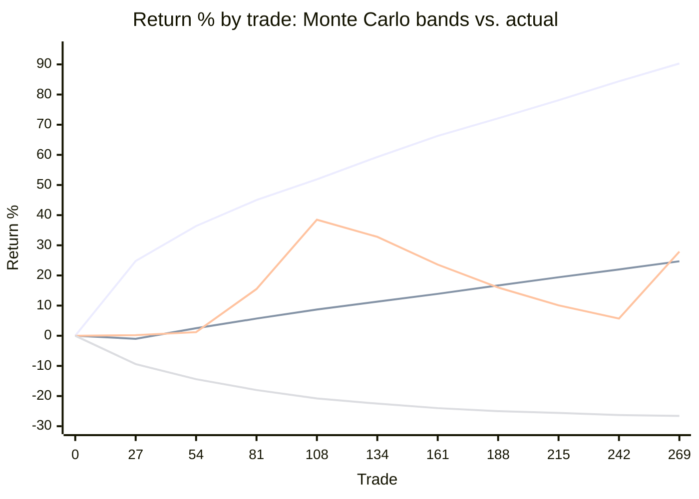

<div align="center">

# NoraBT Agent

**AI risk supervisor for OKX copy-trading bots**

[Live app](https://agent.expsolution.io) · [System overview](docs/SYSTEM_OVERVIEW.md) · [OKX AI report](docs/OKX_AI_REPORT.md)

</div>

## 1. Why this idea

Copy-trading leaderboards show win rate and ROI, and those two numbers hide the
risks that actually wipe out copiers:

- **Hidden losses:** trades in profit are closed fast, losing trades are held open.
- **Martingale and leverage escalation** behind a smooth-looking curve.
- **Lucky streaks** presented as skill.
- **"Diversified" bots** that fall together.

NoraBT rebuilds each bot's real track record from OKX public data and answers,
with figures, one question: *how much risk do I take by copying this bot?* The
same engine is published on OKX OnchainOS so an AI agent can run the check
before it copies or allocates.

## 2. Use it through OnchainOS (OKX AI)

NoraBT is published on OKX OnchainOS as **Agent SID `40700`** (Agent ID `13753`).
It runs in two modes, both through the same `code` parameter:

| Mode | Input | Output |
|---|---|---|
| **Single** | 1 bot code | Risk report of that bot |
| **Multi** | 2–8 bot codes, comma- or space-separated | One report for the whole portfolio: correlation between bots, joint Monte Carlo, contribution of each bot |

Two or more codes switch to Multi automatically.

```bash
npx -y @okxweb3/onchainos-installer install   # 1. install OnchainOS
onchainos wallet login                        # 2. log in with your OKX wallet
```

**Option A: from an AI agent (AGY, Codex, Claude…).** Prompt:

> Single: *Use Agent SID 40700 on OnchainOS to check OKX bot `EF1CC6F40E834D1A`*
>
> Multi: *Use Agent SID 40700 on OnchainOS to check the portfolio of OKX bots `35F888C7BB441B2B, 6F262ADB3B44266C`*

**Option B: from the terminal** (any machine with OnchainOS and `jq`, no repo needed).
OKX resolves the endpoint from the SID; you only give the SID and the bot code(s).

```bash
CODE="EF1CC6F40E834D1A"          # multi: CODE="35F888C7BB441B2B,6F262ADB3B44266C"
ROUTING=$(onchainos agent service-detail --sid 40700 --agentic-id 13753 \
  | jq -c '{schemaVersion:1, serviceSnapshot:{serviceType:.data.serviceType, endpoint:.data.endpoint, serviceId:.data.sid}}')
CID=$(onchainos agent a2mcp-probe probe --routing-json "$ROUTING" --params-json "{\"code\":\"$CODE\"}" \
  | jq -r '.data.payload.confirmationId')
onchainos agent a2mcp-probe confirm-free --confirmation-id "$CID" --yes
```

<sub>With this repo checked out, `bash docker/run-nora.sh <code> [code ...]` runs the same three steps in one go.</sub>

**Result:** 🟢 **PASS** safe · 🟡 **HIDDEN RISK** hidden risk · 🔴 **REJECT** danger,
plus a link to the full report (charts, 10,000-path Monte Carlo):
`https://agent.expsolution.io/bot/<code>` (single) or
`https://agent.expsolution.io/portfolio/<portfolio id>` (multi; bots that hide
their order book are still counted through their public daily PnL).

<sub>Self-hosting (optional): `cp .env.example .env && docker compose -f docker/docker-compose.yml up -d --build` → web app `:8770`, MCP server `:8765/mcp`.</sub>

## 3. Evidence

One table, computed from the 166 bot reports currently stored and the checks run on them.

| Area | Measure | Result |
|---|---|---|
| **Data** | Bots scored from real OKX data | **166** (112 with public closed trades, 54 without) |
| | Closed trades analysed | **22,144** |
| | OKX API endpoints used | **27** (copy-trading, market, public, Rubik statistics) |
| | Trades placed in a market regime | **90.3%** median per bot |
| | Portfolio (multi-bot) runs | **12** |
| **Verdicts** | Hidden risk | **52** bots |
| | Drawdown low · quality good / weak | **39** / **57** bots |
| | Drawdown high · quality good / weak | **5** / **13** bots |
| **Findings** | Loss hidden in open positions (realized PF ≥ 1, mark-to-market PF < 1) | **7** bots |
| | Out-of-sample validation (walk-forward, 94 bots) | **59** stable · **10** degraded · **17** severely degraded · **8** unknown |
| | Edge statistically proven (Probabilistic Sharpe ≥ 95%) | **58 / 101** |
| | Probability of ruin ≥ 5% | **5 / 101** |
| | Account wiped out on the actual path | **4** bots |
| | Max drawdown, median bot: actual → simulated P95 | **4.0% → 8.7%** |
| **Accuracy** | Simulated max DD P95 ≥ actual max DD | **101 / 101** (P50 only 27 / 101, so P95 is the headline) |
| | Report figures vs. engine recomputation | **0 mismatches** across 166 bots |
| | Overview vs. Detail figures | **0 differences** across 166 bots |
| | Automated tests | **480+ passing** |
| **Methods** | Max drawdown | (peak − trough) / peak equity, capped at 100% |
| | Monte Carlo | Stationary bootstrap (Politis & Romano 1994), 10,000 paths |
| | Tail risk | VaR 95%, CVaR 95%, P95 / P99 max drawdown |
| | Skill vs. luck | Probabilistic & Deflated Sharpe, MinTRL (Bailey & López de Prado) |
| | Robustness | Walk-forward out-of-sample profit factor, regime scenarios |
| | Risk scale | Low < 30 · Moderate 30–49 · Elevated 50–69 · High 70–84 · Critical ≥ 85 |

## 4. Growth: simulated vs. actual

Bot `3EB985F124C18792`, return on current capital over 269 trades. Monte Carlo
bands (P05 / P50 / P95) against the bot's real path:



<sub>Lines, top to bottom at trade 269: P95 good case (+90.3%) · actual (+27.9%) · P50 median (+24.7%) · P05 bad case (−26.6%).</sub>

The actual path stays inside the simulated band. Its max drawdown (25.4%) sits
between the typical (P50 18.2%) and the bad case (P95 38.2%), which is the risk
figure the report leads with.

## 5. Conclusion

NoraBT turns a copy-trading leaderboard entry into an audited risk report:
standard metrics, stress-tested by simulation, checked against the bot's own
history, and colour-coded safe / risk / danger. The same assessment is
available to people through the web app and to AI agents through OKX
OnchainOS (Agent SID 40700).
