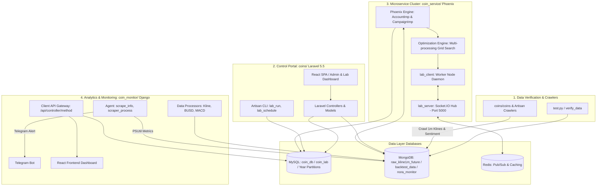

# DCA Backtest Ecosystem (`norabt`)

Hệ thống kiểm thử chiến lược giao dịch tự động (Backtest), tối ưu hóa tham số (Parameter Optimization) và Giám sát dữ liệu thị trường Crypto (Market Data Monitoring & Analysis) đa tầng.

Dự án kết hợp kiến trúc **Laravel (PHP)** cho hệ thống quản lý/điều hành web, **Django/Python** cho động cơ mô phỏng backtest & tính toán chỉ báo thị trường, cùng kiến trúc **Phân tán (Distributed Cluster)** hỗ trợ tính toán song song trên nhiều node worker.

> 📌 **Tài liệu Hướng dẫn Cài đặt Chi tiết**: Vui lòng tham khảo file [`SETUP.md`](file:///Users/nevir/Desktop/DCA_backtest/SETUP.md) để xem đầy đủ các bước setup môi trường, cấu hình Nginx, cài đặt PHP 7.2 extensions, khôi phục MySQL DB, và khởi chạy PM2 services.

---

## 📋 Mục lục

- [1. Tổng quan hệ thống (Architecture Overview)](#1-tổng-quan-hệ-thống-architecture-overview)
- [2. Sơ đồ kiến trúc (System Diagram)](#2-sơ-đồ-kiến-trúc-system-diagram)
- [3. Cấu trúc và Chi tiết các Thành phần chính](#3-cấu-trúc-và-chi-tiết-các-thành-phần-chính)
  - [3.1. `coins/` - Laravel Web Portal & Cron Scheduler](#31-coins---laravel-web-portal--cron-scheduler)
  - [3.2. `coin_service/` - Động cơ Phoenix Backtest & Distributed Parameter Optimizer](#32-coin_service---động-cơ-phoenix-backtest--distributed-parameter-optimizer)
  - [3.3. `coin_monitor/` - Data Ingestion, Monitoring Agent & React Dashboard](#33-coin_monitor---data-ingestion-monitoring-agent--react-dashboard)
  - [3.4. Root Config & Utility Scripts (`lab.yml`, `test.py`)](#34-root-config--utility-scripts-labyml-testpy)
- [4. Kiến trúc Dữ liệu (Database Architecture)](#4-kiến-trúc-dữ-liệu-database-architecture)
- [5. Hướng dẫn Cài đặt & Vận hành (Setup & Usage Summary)](#5-hướng-dẫn-cài-đặt--vận-hành-setup--usage-summary)
  - [5.1. Tóm tắt các bước Setup](#51-tóm-tắt-các-bước-setup)
  - [5.2. Khởi chạy Services & PM2 Cluster](#52-khởi-chạy-services--pm2-cluster)
- [6. Tổng kết](#6-tổng-kết)

---

## 1. Tổng quan hệ thống (Architecture Overview)

Dự án `DCA_backtest` (tên mã: `norabt` / `Phoenix`) được thiết kế nhằm giải quyết các bài toán lớn trong giao dịch định lượng (Quantitative Trading) và DCA (Dollar-Cost Averaging) tiền điện tử:

1. **Crawl & Thu thập Dữ liệu Nến (Kline/Tick Data)**: Tải và lưu trữ hàng triệu dữ liệu nến 1 phút (1m), 1 giây (1s), Orderbook depth, và AggTrades từ Binance (Spot & Futures) vào MongoDB.
2. **Quản lý Chiến dịch & Chiến lược (Campaign & Strategy Management)**: Cung cấp giao diện Web UI (Laravel + React) cho phép tạo lập tài khoản mô phỏng, thiết lập tham số chiến dịch (Leverage, Margin, Phase DCA, Step Profit, Trailing Stop, Stop Loss, Take Profit).
3. **Động cơ Mô phỏng Backtest (Phoenix Engine)**: Chạy backtest trên chuỗi dữ liệu lịch sử nến 1m/multi-timeframe, tính toán PnL, slippage, drawdown, cân bằng ký quỹ thực tế.
4. **Tối ưu hóa Tham số Phân tán (Distributed Parameter Optimization Grid-Search)**: Sinh ma trận tham số (INPUT, SETS, EXPRESSIONS), tự động phân phối các bài toán tối ưu qua Socket.IO / Redis PubSub tới danh sách các Worker Node (phân tán CPU đa nhân).
5. **Giám sát Hạ tầng & Telegram Alerts**: Tự động đo lường hiệu năng máy chủ (CPU, RAM, Disk), theo dõi các tiến trình crawl/backtest, và cảnh báo tức thời qua Telegram Bot.

---

## 2. Sơ đồ kiến trúc (System Diagram)



---

## 3. Cấu trúc và Chi tiết các Thành phần chính

### 3.1. `coins/` - Laravel Web Portal & Cron Scheduler

`coins/` là ứng dụng xây dựng trên **Laravel 5.5 (PHP 7.2)**, đóng vai trò là trung tâm điều hành, quản lý database, cấu hình chiến dịch backtest và giao diện quản trị viên.

#### Thư mục & Thành phần chính:
- **`coins/config/database.php`**: Cấu hình kết nối lai (Hybrid Database):
  - **MySQL Partitioning**: Phân vùng database theo năm (`coin_lab_2017` đến `coin_lab_2021`, `coin_lab_future_*`) giúp xử lý dữ liệu giao dịch khổng lồ mà không bị nỗ nghẽn bảng.
  - **MongoDB Integration** (`jenssegers/mongodb`): Kết nối các collection `raw_kline1m_future`, `backtest_data_1m`, `ftx_backtest_data`.
  - **Redis**: Cấu hình cache và Message Queue.
- **`coins/coins`**: Script Crontab hệ thống định kỳ gọi các lệnh Artisan:
  - `coin_list`, `coin_history`: Cập nhật danh sách đồng coin và lịch sử giá.
  - `coin_fear`: Thu thập chỉ số Fear & Greed Index từ thị trường.
  - `coin_transaction`, `coin_telegram`, `coin_twitter`: Crawl dữ liệu mạng xã hội và giao dịch lớn.
- **`coins/app/Console/Commands/`** (48 Artisan Commands):
  - `Lab_run.php` (`php artisan lab_run {campaign}`): Khởi chạy mô phỏng chiến dịch backtest.
  - `Lab_schedule.php`, `Lab_opt_schedule.php`: Lên lịch tự động hóa backtest và tối ưu hóa tham số.
  - `Crawler_candle24h.php`, `Crawler_price_1s.php`: Crawl nến 24h và tick giá 1s.
  - `Telegram_send.php`, `Order_alert.php`: Gửi thông báo Telegram khi phát sinh lệnh.
- **`coins/routes/web.php` & `api.php`**: Cung cấp đường dẫn UI cho trang quản trị (`/admin`) và không gian làm việc mô phỏng chiến dịch (`/lab`).

---

### 3.2. `coin_service/` - Động cơ Phoenix Backtest & Distributed Parameter Optimizer

`coin_service` (mã hiệu **Phoenix**) là dịch vụ backend cốt lõi viết bằng **Django/Python**, chịu trách nhiệm tính toán backtest chuyên sâu và tối ưu hóa tham số chiến lược theo cụm máy chủ phân tán (Distributed Computing Cluster).

#### Thư mục & Thành phần chính:
- **`crypto_lab/`**: Thư mục cấu hình Django project (`settings.py.template`, `urls.py`, `wsgi.py`).
- **`api/` - Hệ thống Giao tiếp Phân tán & Socket Server**:
  - **`lab_server.py`**: Socket.IO Hub chạy trên port 5000 (Eventlet backend), lắng nghe kênh Redis `lab_order`, quản lý danh sách worker node (`LabNode`) và điều phối task.
  - **`lab_client.py`**: Tiến trình daemon chạy ngầm ở từng worker node, kết nối với `lab_server` qua WebSocket (xác thực bằng JWT) để nhận lệnh chạy backtest/optimization.
  - **`api/urls.py`**: Router động (`processRoute`) tự động ánh xạ truy vấn `/api/<controller>/<method>` vào controller tương ứng trong package `api.Controller`.
- **`Console/Phoenix/` - Động cơ Trading Simulation (Phoenix Core)**:
  - **`AccountImp.py` / `AccountAsyncImp.py`**: Quản lý tài khoản backtest, nạp chuỗi nến lịch sử từ MongoDB theo từng block thời gian (1-15 ngày), tính toán số dư, ký quỹ, unrealized PnL, drawdown.
  - **`CampaignImp.py` / `CampaignImp1m.py`**: Thực thi logic chiến lược chi tiết. Đánh giá biểu thức điều kiện lồng phức tạp (`compareAnd`, `compareOr`, `compare`), quản lý giai đoạn vào lệnh DCA, tính Take Profit, Stop Loss, Trailing Stop (`step_profit`, `back_profit`), thời gian sống của lệnh (lifetime).
- **`Console/Phoenix/Lab/Optimization.py` - Động cơ Tối ưu hóa Tham số (Grid-Search)**:
  - Tự động sinh ma trận tổ hợp tham số từ cấu hình JSON (`lab_opt_params`) với 3 kiểu mở rộng: `INPUT`, `SETS`, `EXPRESSIONS`.
  - Sử dụng `multiprocessing.Process` phân phối tính toán song song trên đa nhân CPU.
  - Ghi nhận kết quả chi tiết (lợi nhuận cuối, đợt sụt giảm tài sản lớn nhất, số lệnh TP/SL) vào MySQL table `lab_opt_result`.
- **`start` / `stop`**: Các shell script điều khiển bật/tắt `lab_client` daemon dưới nền.

---

### 3.3. `coin_monitor/` - Data Ingestion, Monitoring Agent & React Dashboard

`coin_monitor` là hệ thống Django đa chức năng đóng vai trò trung tâm phân tích dữ liệu thị trường, tính toán chỉ báo kỹ thuật, giám sát hạ tầng máy chủ và hiển thị trực quan hóa qua React SPA.

#### Thư mục & Thành phần chính:
- **`nora_monitor/settings.py`**: Cấu hình kết nối **hơn 15 Database khác nhau** (MongoDB `raw_kline1m_future`, `backtest_data_1m`, MySQL `coin_lab`, SQLite local, v.v.).
- **`Agent/` - Giám sát Hạ tầng Máy chủ**:
  - `scrape_info`: Sử dụng `psutil` đo lường mức độ sử dụng CPU, RAM, SSD/HDD. Tự động phát cảnh báo qua Telegram khi tài nguyên vượt ngưỡng 95%.
  - `scraper_process`: Theo dõi toàn bộ các script Python crawler đang chạy, tham số CLI, tài nguyên tiêu thụ.
  - `scraper_coin`: Kiểm tra các feed dữ liệu coin trên MongoDB, phát hiện feed ngưng hoạt động (> 3 phút không có bản ghi mới).
- **`Backtest/` - Thu thập & Biến đổi Dữ liệu**:
  - `crawl_kline_1m_bulk`: Tải dữ liệu nến 1m từ Binance REST API với cơ chế chống vượt rate-limit (`X-MBX-USED-WEIGHT-1M`).
  - `klineProcessor.py`, `BusdProcessor.py`: Tính toán trước các chỉ báo kỹ thuật (EMA 5/9/12/13/26, MACD, Volume BU/SD, WMA) cho các khung thời gian 15m, 60m, 240m, 1440m và lưu vào `backtest_data_1m`.
- **`Client/` - REST API Gateway**: Cung cấp API động cho frontend qua định dạng `/api/<controller>/<method>` (ví dụ: `ScraperController`, `RealtimeController`, `AuthenticationController`).
- **`frontend/`**: Ứng dụng Web Single-Page (React + Webpack + PrimeReact) hiển thị Dashboard thông số hệ thống, danh sách tiến trình, biểu đồ backtest và trạng thái dữ liệu.

---

### 3.4. Root Config & Utility Scripts (`lab.yml`, `test.py`)

- **`lab.yml`**: File định nghĩa môi trường Anaconda/Conda (tên môi trường: `lab`, Python **3.9.18**). Chứa đầy đủ các thư viện phụ thuộc:
  - **Frameworks & Core**: `django==3.1.12`, `djongo==1.3.7`, `pymongo==3.11.4`, `mysqlclient==2.1.0`.
  - **Data Science & Plotting**: `pandas==2.2.3`, `numpy==2.0.2`, `plotly==6.0.0`.
  - **Async & WebSockets**: `python-socketio==5.12.1`, `websocket-client==1.8.0`, `eventlet==0.39.0`, `gevent==21.12.0`, `redis==5.2.1`.
- **`test.py`**: Script Python tự động kết nối MongoDB (`mongodb://localhost:27017/`), quét toàn bộ collection trong database `raw_kline1m_future` để phát hiện các đồng coin bị thiếu hoặc rỗng dữ liệu trước khi thực hiện backtest.

---

## 4. Kiến trúc Dữ liệu (Database Architecture)

Hệ thống kết hợp 3 loại Database nhằm tối ưu hiệu năng:

1. **MySQL (Relational DB)**:
   - **Mục đích**: Lưu trữ thông tin tài khoản mô phỏng (`LabAccount`), chiến dịch (`LabCampaigns`), danh sách lệnh (`LabOrder`), kết quả backtest (`LabResults`), ma trận tối ưu (`LabOptimization`, `LabOptResult`) và danh sách node worker (`LabNode`).
   - **Phân vùng (Partitioning)**: Phân tách dữ liệu nến và giao dịch theo từng năm (`coin_lab_2017` $\rightarrow$ `coin_lab_2021`) để tránh nghẽn truy vấn.
2. **MongoDB (NoSQL Document Store)**:
   - **Mục đích**: Chuyên dụng lưu trữ dữ liệu chuỗi thời gian (Time-series) khối lượng cực lớn (> 600GB).
   - **Databases**:
     - `raw_kline1m_future` / `raw_kline1m_spot`: Nến 1 phút nguyên bản từ sàn Binance.
     - `backtest_data_1m`: Dữ liệu nến đã qua xử lý & enrich các chỉ báo kỹ thuật (EMA, MACD, Volume BU/SD).
     - `nora_monitor`: Thông tin log giám sát tiến trình và phần cứng máy chủ.
3. **Redis (In-Memory Data Store)**:
   - **Mục đích**: Kênh Message Broker (Pub/Sub) truyền nhận thông điệp thời gian thực giữa `lab_server` và `lab_client`, đồng thời lưu trữ cache trạng thái hệ thống.

---

## 5. Hướng dẫn Cài đặt & Vận hành (Setup & Usage Summary)

> 💡 Chi tiết từng bước cài đặt xem tại: [`SETUP.md`](file:///Users/nevir/Desktop/DCA_backtest/SETUP.md)

### 5.1. Tóm tắt các bước Setup

1. **Clone Source Code**:
   ```bash
   git clone git@github.com:NORATN/DCA_backtest.git
   cd DCA_backtest
   ```
2. **Tạo & Kích hoạt Môi trường Conda**:
   ```bash
   conda env create -f lab.yml
   conda activate lab
   ```
3. **Khởi tạo Database Services**:
   - Cài đặt MySQL, MongoDB, Redis.
   - Import schema cơ sở dữ liệu MySQL (`mysql -u root -p coin_lab < coins/database/laravel_itcjsc.sql` hoặc `lab.sql`).
4. **Cài đặt Web Portal `coins/`**:
   - Cài đặt PHP 7.2 & extensions (`php7.2-cli`, `php7.2-fpm`, `php7.2-mbstring`, `php7.2-curl`, `php7.2-mysql`, v.v.).
   - `cd coins && composer install && npm install && npm run prod`.
   - `cp .env.exp .env && php artisan key:generate`.
5. **Crawl & Xử lý Dữ liệu Market**:
   ```bash
   cd coin_monitor
   python manage.py crawl_kline_1m_bulk
   python manage.py process_kline_1m_bulk
   python manage.py verify_data
   ```

---

### 5.2. Khởi chạy Services & PM2 Cluster

Sử dụng PM2 để khởi chạy các background services trên máy chủ Linux:

```bash
cd coin_service
pm2 start python --name "dca_lab_server" -- manage.py lab_server
pm2 start python --name "dca_lab_client" -- manage.py lab_client
pm2 save
```

Cấu hình Nginx trỏ vào thư mục `coins/public` với socket `unix:/run/php/php7.2-fpm.sock` để mở giao diện điều hành `/admin` và `/lab`.

---

## 6. Tổng kết

Hệ thống **`DCA_backtest` (`norabt`)** là một nền tảng giao dịch định lượng hoàn chỉnh, được phân tách rõ ràng giữa:
- **Tầng quản trị & Web UI** (`coins/` - Laravel).
- **Tầng tính toán & Tối ưu hóa phân tán** (`coin_service/` - Django & Phoenix Engine).
- **Tầng xử lý dữ liệu & Giám sát hạ tầng** (`coin_monitor/` - Django, React & Agents).

Kiến trúc này đảm bảo tính mở rộng cao (Scalability), khả năng tính toán song song vượt trội trên nhiều CPU core/node, và khả năng vận hành ổn định bền bỉ trên thị trường tiền điện tử.
