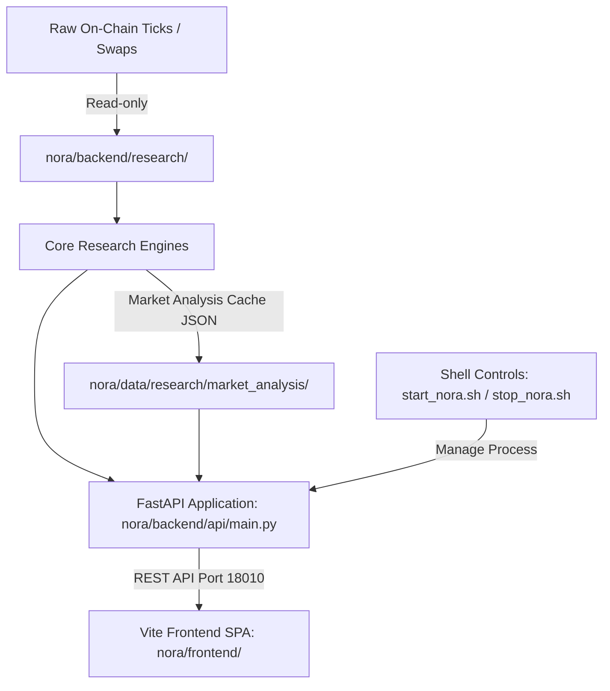

# 01. KIẾN TRÚC HỆ THỐNG & BẢN ĐỒ MÃ NGUỒN (ARCHITECTURE & CODEMAP)

Tài liệu này cung cấp bản đồ định tuyến chi tiết toàn bộ codebase dự án Nora. Bất kỳ kỹ sư phần mềm (Developer) hay AI Assistant nào cũng có thể nhanh chóng định vị chính xác file code cần xem/sửa mà không cần phải grep mò mẫm.

---

## 1. Sơ Đồ Khối Kiến Trúc Tổng Thể (High-Level Architecture)

---

## 2. Bản Đồ File Mã Nguồn Chi Tiết (Code Map)

### 2.1. Tầng Nghiên Cứu Định Lượng (`nora/backend/research/`)
Đây là trái tim của hệ thống định lượng Nora, nơi xử lý tick-data, Directional Change và kiểm định giả thuyết:

| File | Đường Dẫn | Trách Nhiệm Kỹ Thuật |
| :--- | :--- | :--- |
| **`market_analyzer.py`** | [market_analyzer.py](file:///home/ubuntu/norabt/nora/backend/research/market_analyzer.py) | **Nhạc trưởng phân tích**: Điều phối quét toàn bộ DEX Universe 50 assets, quản lý cache độc lập (`universe_15m.json`, `universe_1h.json`, `universe_4h.json`), tính toán phân loại thị trường. |
| **`dc_feature_extractor.py`** | [dc_feature_extractor.py](file:///home/ubuntu/norabt/nora/backend/research/dc_feature_extractor.py) | **Bóc tách Directional Change**: Phân rã chuỗi tick thành các biến cố DC theo ngưỡng $\theta^*$, tính tỷ số Overshoot $R_{OS}$ và Intrinsic Time. |
| **`edge_falsifier.py`** | [edge_falsifier.py](file:///home/ubuntu/norabt/nora/backend/research/edge_falsifier.py) | **Bộ máy phản nghiệm & Chi phí Stress**: Chạy mô hình 4 cấp độ chi phí (Zero ➔ Baseline ➔ Conservative ➔ Stress Hurdle), tính Gross/Net Expectancy và cấp cờ `SURVIVED` hay `FALSIFIED`. |
| **`regime_classifier.py`** | [regime_classifier.py](file:///home/ubuntu/norabt/nora/backend/research/regime_classifier.py) | **Phân loại trạng thái**: Tính Choppiness Index, độ bung mở Volatility và Flow Imbalance để gán nhãn `RANGE_CHOP`, `VOL_EXPANSION`, v.v. |
| **`event_behavior.py`** | [event_behavior.py](file:///home/ubuntu/norabt/nora/backend/research/event_behavior.py) | **Hành vi bước sóng vi mô**: Tính toán pha hồi quy (Bounce after Pullback), Unity Band (0.20-0.32R) và tạo quỹ đạo tick cho Trade List. |
| **`market_health.py`** | [market_health.py](file:///home/ubuntu/norabt/nora/backend/research/market_health.py) | **Chấm điểm sức khỏe**: Tổng hợp Market Health Score (0-100) dựa trên thanh khoản, mật độ tick, độ tin cậy scaling laws và spread. |
| **`scaling_law.py`** | [scaling_law.py](file:///home/ubuntu/norabt/nora/backend/research/scaling_law.py) | **Định luật lũy thừa**: Khớp đường hồi quy $N(\theta) \propto \theta^{-E}$ để kiểm tra độ lành mạnh của phân phối giá. |
| **`playbook_recommender.py`** | [playbook_recommender.py](file:///home/ubuntu/norabt/nora/backend/research/playbook_recommender.py) | **Đề xuất chiến thuật**: Map giữa Regime và DC Phase để đưa ra Playbook (`DC_OVERSHOOT_FADE`, `VOL_EXPANSION_BREAKOUT`...). |
| **`data_quality_gate.py`** | [data_quality_gate.py](file:///home/ubuntu/norabt/nora/backend/research/data_quality_gate.py) | **Cổng kiểm soát chất lượng**: Phát hiện khoảng trống dữ liệu (gap), tick trùng timestamp, giá âm hoặc bất thường đột biến. |

---

### 2.2. Tầng API & Máy Chủ Backend (`nora/backend/api/`)

| File | Đường Dẫn | Chức Năng |
| :--- | :--- | :--- |
| **`main.py`** | [main.py](file:///home/ubuntu/norabt/nora/backend/api/main.py) | Ứng dụng FastAPI chính (Port `18010`). Phục vụ các REST endpoints:  • `/api/health`: Trạng thái máy chủ  • `/api/research/analysis/universe`: Danh sách 50 assets theo khung thời gian  • `/api/research/analysis/asset/{symbol}`: Bóc tách chi tiết vi mô của từng asset |
| **`schemas.py`** | [schemas.py](file:///home/ubuntu/norabt/nora/backend/api/schemas.py) | Pydantic Schemas định nghĩa cấu trúc dữ liệu trả về của API. |

---

### 2.3. Tầng Giao Diện Web (`nora/frontend/`)

| Thư Mục / File | Đường Dẫn | Chức Năng |
| :--- | :--- | :--- |
| **`src/`** | [src/](file:///home/ubuntu/norabt/nora/frontend/src) | Mã nguồn Frontend SPA (Vanilla JS + CSS hệ thống chuẩn Quants, dark theme sang trọng). |
| **`dist/`** | [dist/](file:///home/ubuntu/norabt/nora/frontend/dist) | Bản build tĩnh được FastAPI serve trực tiếp tại các routes:  • `/research/analysis`: Market Research Command Center  • `/research/analysis/asset/{symbol}`: Chi tiết tài sản & Causal Tick trajectory |

---

### 2.4. Tầng Dữ Liệu & Cache Disk (`nora/data/`)

| Đường Dẫn | Nội Dung |
| :--- | :--- |
| `nora/data/research/market_analysis/universe_15m.json` | Cache vũ trụ 50 coin khung 15 phút (tải <15ms) |
| `nora/data/research/market_analysis/universe_1h.json` | Cache vũ trụ 50 coin khung 1 giờ (tải <15ms) |
| `nora/data/research/market_analysis/universe_4h.json` | Cache vũ trụ 50 coin khung 4 giờ (tải <15ms) |
| `nora/data/research/market_analysis/{symbol}_{tf}.json` | Cache bóc tách chi tiết từng cặp tài sản |

---

### 2.5. Tầng Điều Khiển Vận Hành (Root Shell Scripts)

| Script | Đường Dẫn | Trách Nhiệm |
| :--- | :--- | :--- |
| **`start_nora.sh`** | [start_nora.sh](file:///home/ubuntu/norabt/start_nora.sh) | Dọn dẹp port 18010 cũ, kích hoạt uv python environment, khởi động uvicorn daemon và kiểm tra `/api/health`. |
| **`stop_nora.sh`** | [stop_nora.sh](file:///home/ubuntu/norabt/stop_nora.sh) | Gửi SIGTERM tới PID server, fallback SIGKILL nếu còn treo và dùng `fuser -k 18010/tcp` giải phóng port. |
