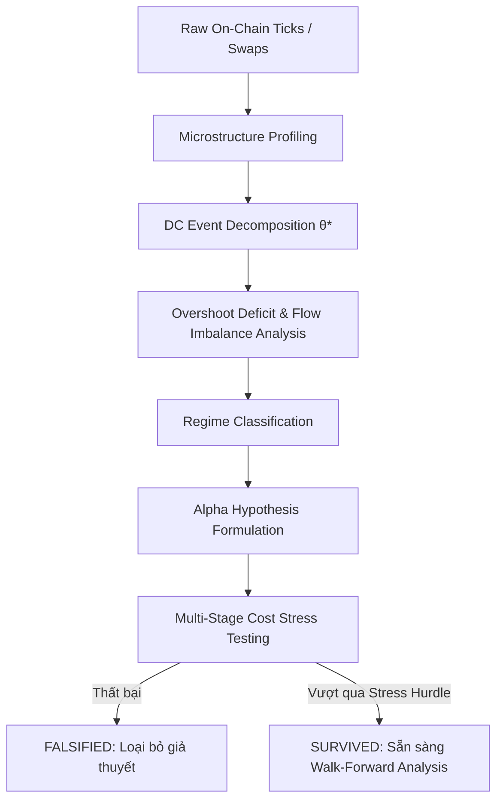

# 01. TẦM NHÌN CỐT LÕI & TRIẾT LÝ HỆ THỐNG NORA

## 1. Tầm Nhìn Dự Án (Core Vision)
Nora không phải là một bot giao dịch chỉ báo kỹ thuật thông thường (RSI, MACD, Bollinger Bands dựa trên nến thời gian vật lý). 
**Nora là một phòng thí nghiệm định lượng (Quantitative Research & Falsification Engine)** chuyên sâu về vi cấu trúc thị trường phi tập trung (DEX Microstructure).

Mục tiêu tối thượng của Nora là:
1. **Khám phá quy luật tự nhiên của thị trường (Empirical Scaling Laws)**: Tìm ra các đặc tính phân phối thống kê bất biến trong dòng lệnh (order flow) và biến động giá on-chain.
2. **Loại bỏ ảo tưởng PnL (Alpha Falsification)**: Mọi chiến lược hoặc giả thuyết giao dịch trước khi được triển khai đều phải chịu quy trình phản nghiệm (falsification) khắc nghiệt nhất, từ điều kiện lý tưởng (Zero Cost) tới môi trường ma sát thực tế khắc nghiệt (Stress Hurdle).
3. **Chống Overfitting tuyệt đối**: Không tối ưu hóa tham số cục bộ; chỉ dựa vào các điểm cân bằng vật lý của giá (Intrinsic Time, Overshoot Deficit, Flow Imbalance).

---

## 2. Triết Lý Về Dữ Liệu: Tại Sao Nến (Candlestick) Là "Kẻ Lừa Dối"?

### 2.1. Sai Lầm Của Thời Gian Vật Lý (Physical Time)
- Thời gian vật lý chia thị trường thành các ô cố định (1 phút, 15 phút, 1 giờ).
- **Vấn đề**: Thị trường tài chính không thở theo nhịp kim đồng hồ.
  - Lúc nửa đêm, trong 1 giờ chỉ có 5 giao dịch nhỏ giọt, nhưng vẫn tạo ra 1 nến 1H.
  - Lúc tin tức lớn xuất hiện, trong 1 phút có tới 10,000 giao dịch bùng nổ, nhưng lại bị nén thành 1 nến 1M duy nhất, làm mất toàn bộ cấu trúc vi mô bên trong (trật tự khớp lệnh, thanh khoản cạn kiệt, chuỗi trượt giá).

### 2.2. Intrinsic Time (Thời Gian Nội Tại) Của Nora
- Nora chuyển dịch hệ quy chiếu từ **Physical Time** sang **Intrinsic Time** dựa trên biến cố **Directional Change (DC)**.
- Đồng hồ của Nora chỉ tích tắc khi giá thực sự di chuyển một biên độ vượt ngưỡng tham số $\theta$ (threshold).
- Trong những giai đoạn thị trường đóng băng, Intrinsic Time dừng lại (không sinh nhiễu). Trong giai đoạn bão giá, Intrinsic Time mở rộng với tần số cao, ghi nhận từng nhịp đập thực sự của dòng tiền on-chain.

---

## 3. Dòng Chảy Nghiên Cứu (Research Flow)
Dòng chảy chuẩn mực của một giả thuyết thị trường trong hệ thống Nora:

Mọi module kỹ thuật được viết trong Nora đều phải phục vụ trực tiếp và tuân thủ chặt chẽ dòng chảy này.
